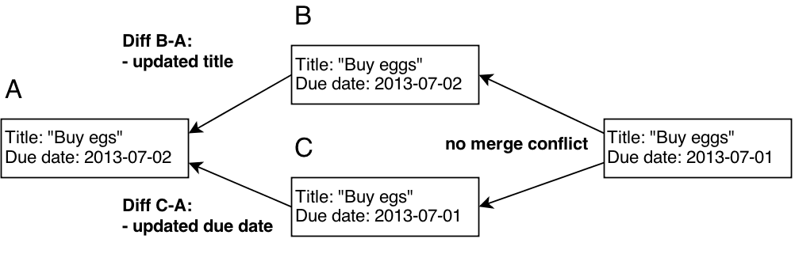
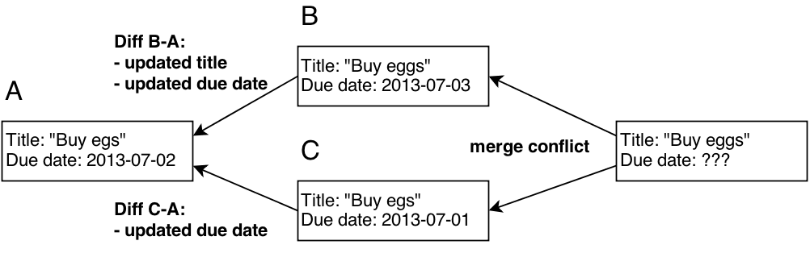
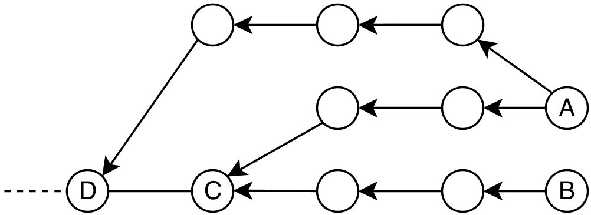
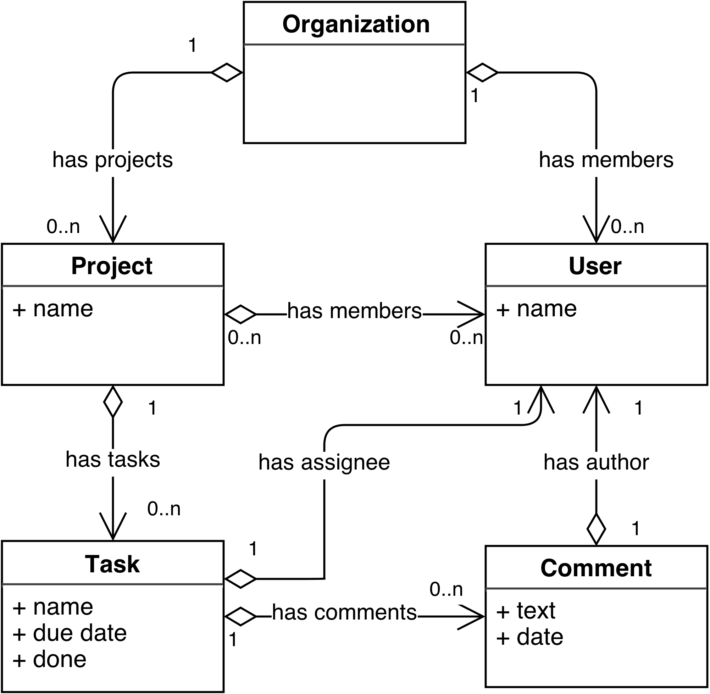
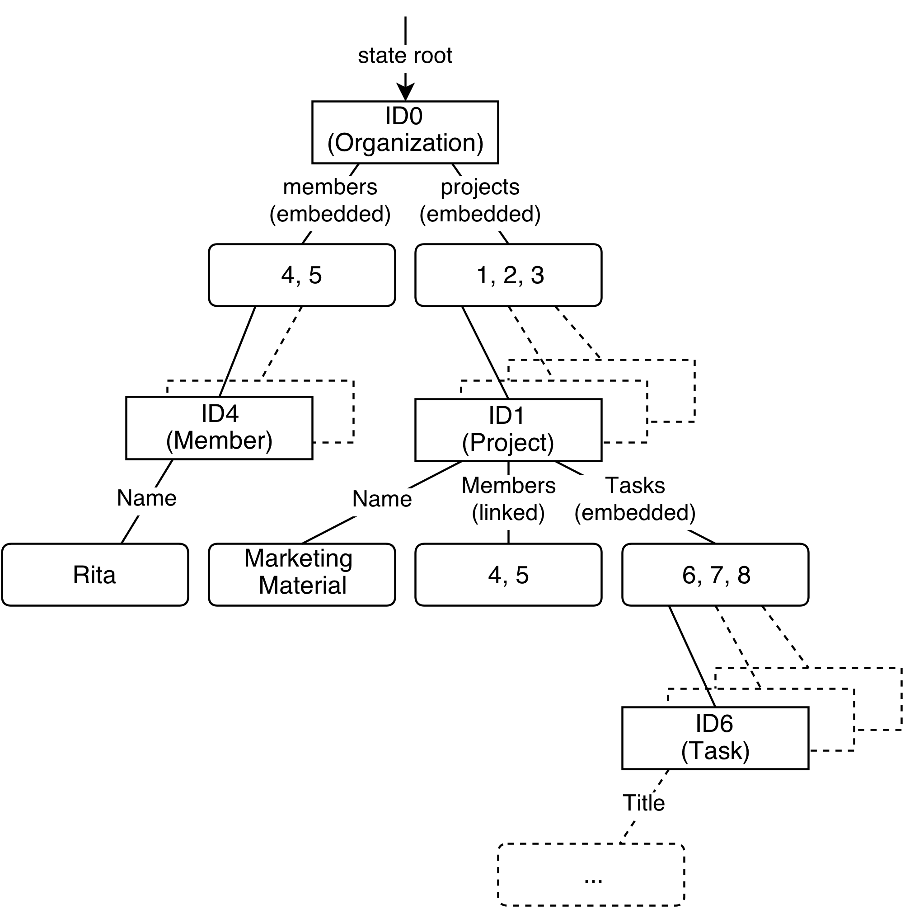

# Heidelberg University Institute of Computer Science Database Systems Research Group

**Bachelor Thesis**

## Histo: A Protocol for Peer-to-Peer Data Synchronization in Mobile Apps

Name: Mirko Kiefer  
Matricle: 2746040  
Supervisor: Prof. Dr. Gertz  
Date of Submission: September 27, 2013

I declare that this thesis was composed by myself and that the work contained therein is my own, except where explicitly stated otherwise in the text.

Date of Submission: September 27, 2013

# Abstract

Inspired by distributed version control for source code we develop Histo, which is a framework for peer-to-peer data synchronization in mobile applications.

Our objectives when developing Histo are driven by exemplaric workflows in a collabo- rative task manager. We see **offline support** as a key requirement of modern mobile applications. Histo is designed to keep all data locally on the client device to ensure a user is not blocked from using an application.

Every application has a different data model, we develop methods to support **flexible data models**. We show that by mapping an application’s data to a hierarchical model, we can efficiently synchronize data.

Locking mechanisms are shown to be non-feasible when working with loosely connected devices. The **synchronization protocol**, which is at the heart of Histo, is therefore designed to work without any locking logic. We instead rely on a concept of **optimistic synchronization**, which guarantees **eventual consistency** of an application’s data. Handling concurrent edits and resulting conflicts correctly is another core element of Histo. Histo merges concurrent edits and identifies conflicts using **three-way-merging**. We find that the only way to implement three-way-merging in a distributed setting is by tracking the edit history on each device.

Histo’s synchronization protocol is shown to perform well in a range of network topolo- gies. The most extreme cases being **client-server** and **peer-to-peer**. For each network topology, we show how assumptions we make on the data history allows to minimize the amount of data stored on each device.

We focus on developing a practical solution that works on a broad range of devices. Histo is therefore implemented with **open web standards**. To our knowledge there are no publicly available solutions with these objectives.

We see potential to continue the work by exploring other application scenarios and adding support for different types of data. This could include conflict handling support for specialized data structures like those of a spreadsheet or a text editor.

- [Heidelberg University Institute of Computer Science Database Systems Research Group](#heidelberg-university-institute-of-computer-science-database-systems-research-group)
  - [Histo: A Protocol for Peer-to-Peer Data Synchronization in Mobile Apps](#histo-a-protocol-for-peer-to-peer-data-synchronization-in-mobile-apps)
- [Abstract](#abstract)
- [1 Introduction](#1-introduction)
  - [1.1 Motivation](#11-motivation)
  - [1.2 Objectives and Approach](#12-objectives-and-approach)
  - [1.3 Structure of the Thesis](#13-structure-of-the-thesis)
- [2 Background](#2-background)
  - [2.1 Defining Data Synchronization](#21-defining-data-synchronization)
  - [2.2 Transactions and Consistency](#22-transactions-and-consistency)
  - [2.3 Stream-Based Synchronization](#23-stream-based-synchronization)
  - [2.4 History-Based Synchronization](#24-history-based-synchronization)
  - [2.5 Three-Way Merging](#25-three-way-merging)
  - [2.6 Lowest Common Ancestor](#26-lowest-common-ancestor)
  - [2.7 Content Adressable Storage](#27-content-adressable-storage)
  - [2.8 HTML5 and Offline Applications](#28-html5-and-offline-applications)
    - [2.8.1 Web Storage](#281-web-storage)
    - [2.8.2 Web SQL Database](#282-web-sql-database)
    - [2.8.3 Indexed Database](#283-indexed-database)
    - [2.8.4 Cache Manifests](#284-cache-manifests)
- [3 Application Scenario - A Collaborative Task Manager](#3-application-scenario---a-collaborative-task-manager)
  - [3.1 User Story 1: Creating Projects](#31-user-story-1-creating-projects)
  - [3.2 User Story 2: Creating and Editing Tasks](#32-user-story-2-creating-and-editing-tasks)
  - [3.3 User Story 3: Commenting on Tasks](#33-user-story-3-commenting-on-tasks)
  - [3.4 User Story 4: User Workflows](#34-user-story-4-user-workflows)
  - [3.5 Data Schema](#35-data-schema)
- [4 Requirements](#4-requirements)
  - [4.1 Flexible Data Model Support](#41-flexible-data-model-support)
  - [4.2 Optimistic Synchronization](#42-optimistic-synchronization)
  - [4.3 Causality Preservation and Conflicts](#43-causality-preservation-and-conflicts)
  - [4.4 Flexible Network Topologies](#44-flexible-network-topologies)
  - [4.5 Integration with Existing Application Logic](#45-integration-with-existing-application-logic)
  - [4.6 Cross-Platform](#46-cross-platform)
  - [4.7 Other Requirements](#47-other-requirements)
  - [4.8 Summary](#48-summary)
- [5 Architecture of CouchDB](#5-architecture-of-couchdb)
  - [5.1 Overview](#51-overview)
  - [5.2 Synchronization Protocol](#52-synchronization-protocol)
  - [5.3 Fulfillment of Requirements](#53-fulfillment-of-requirements)
- [6 Architecture of Histo](#6-architecture-of-histo)
  - [6.1 Hierarchical Data Model Mapping](#61-hierarchical-data-model-mapping)
  - [6.2 Committing Objects](#62-committing-objects)
  - [6.3 Synchronization Protocol](#63-synchronization-protocol)
    - [6.3.1 Update Detection and Propagation](#631-update-detection-and-propagation)
    - [Robustness](#robustness)
    - [6.3.2 Merging](#632-merging)
    - [Robustness](#robustness-1)
  - [6.4 Update Detection Between Branches](#64-update-detection-between-branches)
    - [6.4.1 Commit History Difference](#641-commit-history-difference)
    - [6.4.2 Application Data Change Detection](#642-application-data-change-detection)
  - [6.5 Reconciliation Through Three-Way Merging](#65-reconciliation-through-three-way-merging)
    - [6.5.1 Merge Scenario](#651-merge-scenario)
      - [Ancestor state A of organizations](#ancestor-state-a-of-organizations)
      - [Ancestor state A of users](#ancestor-state-a-of-users)
      - [Ancestor state A of projects](#ancestor-state-a-of-projects)
      - [State B of organizations](#state-b-of-organizations)
      - [State B of projects](#state-b-of-projects)
      - [Ancestor state C of organizations](#ancestor-state-c-of-organizations)
      - [State C of projects](#state-c-of-projects)
      - [Organization difference](#organization-difference)
      - [‘Projects’ attribute difference of organization ID 0](#projects-attribute-difference-of-organization-id-0)
      - [Attribute difference of task ID 4](#attribute-difference-of-task-id-4)
      - [‘Project Name’ difference for project ID 4](#project-name-difference-for-project-id-4)
      - [‘Tasks’ order difference for project ID 4](#tasks-order-difference-for-project-id-4)
      - [‘Project Name’ difference of project ID 5](#project-name-difference-of-project-id-5)
    - [6.5.2 Differencing](#652-differencing)
    - [6.5.3 Diff Merging](#653-diff-merging)
    - [6.5.4 Patching](#654-patching)
    - [6.5.5 Hierarchical Merging](#655-hierarchical-merging)
  - [6.6 Handling Conflicts](#66-handling-conflicts)
  - [6.7 Synchronization Topologies](#67-synchronization-topologies)
    - [6.7.1 Master - Client](#671-master---client)
    - [6.7.2 Client - Client](#672-client---client)
    - [6.7.3 Multi Master - Client](#673-multi-master---client)
    - [6.7.4 Hierarchical](#674-hierarchical)
- [7 Realization](#7-realization)
  - [7.1 Technology](#71-technology)
  - [7.2 Fullfillment of Requirements](#72-fullfillment-of-requirements)
    - [Flexible Data Model Support](#flexible-data-model-support)
    - [Optimistic Synchronization](#optimistic-synchronization)
    - [Causality Preservation and Conflicts](#causality-preservation-and-conflicts)
    - [Flexible Network Topologies](#flexible-network-topologies)
    - [Integration with Existing Application Logic](#integration-with-existing-application-logic)
    - [Cross-Platform](#cross-platform)
  - [7.3 Correctness and Robustness](#73-correctness-and-robustness)
- [8 Conclusion and Outlook](#8-conclusion-and-outlook)
- [Bibliography](#bibliography)

# 1 Introduction

## 1.1 Motivation

Developing mobile applications that work offline and can synchronize peer-to-peer is currently an extremely ambitious task. The problem has been solved for distributed version control of source code with software like git \[1\]. We aim to bring similar concepts to mobile app development.

Applications that allow users to collaborate on data on a central server are in widespread use. Popular examples are document authoring tools like Google Docs \[2\], project col- laboration apps like Basecamp \[3\] or Trello \[4\] or even large scale collaboration projects like Wikipedia \[5\].

The traditional architecture of collaborative applications follows a client-server model where the server hosts the entire application logic and persistence. Users access the application through a thin client, most commonly a web browser. The browser only has to display user interfaces that are pre-rendered by the server.This model works well when using desktop computers with a realiable, high-speed connection to the server.

Rising expectations on the user experience drove developers to increasingly move ap- plication logic to the client. Initially this has only been the logic required to render user interfaces. The server still hosted most of the application logic to pre-compute all relevant data for the client. Moving the interface rendering to the client reduces the amount of data that has to be transferred and makes the application behave more responsive.

The widespread adoption of mobile devices forces developers to re-think their architec- ture again. Users can now carry their devices with them and expect their applications to work outside their home or office network. Applications therefore have to work with limited mobile Internet access or often no access at all.

The only way to support this is by moving more of the application logic to the client and by replicating data for offline use. The clients are now not only responsible for rendering interfaces but also implement most of the application logic themselves.The new architecture comes at a high price - the additional client logic and persistence adds a lot of complexity. While in the server-centric model developers only had to maintain a single technology set, they now face different technologies on each platform they aim to support with a fat client.The ability to use the application offline requires an entire new layer of application logic to manage the propagation and merging of changes and to resolve conflicts. The only responsiblity of the server in this model is the propagation of data between clients.

Most users today carry a notebook, a smartphone and maybe even a tablet computer with them. They often want to work with the same data on different devices. Apps need to support workflows like adding some items to a Todo-Manager on a notebook and sub- sequently reviewing them on a smartphone. This implies that even simple applications that are meant for single-users have to aquire collaborative features. A single-user with multiple devices is from a technical perspective effectively collaborating with himself. Today’s applications only achieve this through data synchronization between the de- vices and a central server. If the user is mobile and does not have a reliable Internet connection he is stuck with outdated data on his smartphone. This problem can only be resolved by supporting the direct synchronization between devices. The clients can now basically act as servers themselves and manage propagation of data to other clients.The actual server does not have to disappear in this model. But like the clients it is just another node on the network. The difference is that the server node is continuously connected to the Internet and can therefore play a useful role as a fallback.Note that this only describes the extreme scenario - in most real-world applications we will see a hybrid-architecture where clients can synchronize most data directly but the server still manages security or enforces other constraints.

Building such a distributed data synchronization engine including all relevant aspects is very complex and beyond the reach of a small team of app developers. As an example the software company “Cultured Code”, which develops one of the most popular task management apps, has spent more than two years developing a generic solution without success \[6\]. It is therefore way beyond the scope of this thesis to develop a generic end-to-end solution. As described in the next section we will focus on a specific set of objectives and use cases.

## 1.2 Objectives and Approach

This thesis aims to develop patterns and tools to make the development of offline capa- ble, collaborative apps more productive.Unique to our approach is that we focus on peer-to-peer data synchronization between mobile devices with a focus on realization with open web standards.Our goal is to bring the features of distributed version control to application data.

Our guiding objectives are:

- **Offline Availability**: Enable the operation of a collaborative app with frequent network partition.
- **Synchronization Protocol**: Develop a protocol for efficient synchronization of changed data directly between devices.
- **Application Integration**: Abstract the synchronization logic to be as unintrusive as possible to an application.

A collaborative app that has to function with an unreliable network connection implies that we cannot rely on the traditional thin client model. We have to think about ways to make both data and logic available offline. The focus of this thesis is on managing offline availability and synchronization of data between collaborating devices.Being able to synchronize data directly between devices forces us to develop a distributed architecture.

Efficient synchronization means that we aim to minimize the amount of redundant data sent between devices. We have to implement methods to identify changes in application data.

Combined with the requirement to be unintrusive we exclude solutions that require the application to explicitly track changes in its code. The identification of data changes should be decoupled from the main application logic. This ensures that an upgrade of traditional applications requires minimal effort.

We will refine this set of requirements by breaking down common use cases and the evaluation of CouchDB, which is an existing solutions that supports offline-capable applications.

Otherwise important questions which are out of scope of this thesis are:

- **Security**: How can we manage access rights and encryption in a distributed architecture?
- **Device Discovery**: How can we discover devices in a network to collaborate with?
- **Data Transmission**: How is the data propagated among devices on a technical level?

## 1.3 Structure of the Thesis

The next chapter starts by describing related work and the necessary background that enables us to develop the synchronization solution.

Developing generic software that is not derived from concrete examples is doomed to fail. Chapter 3 therefore defines a concrete application scenario.The scenario is used to derive the necessary requirements in Chapter 4, which will be used to evaluate our solution.

With CouchDB we evaluate a potential existing solution to our scenario in Chapter 5. Chapter 6 finally introduces Histo, our own solution for distributed data synchronization. A discussion of our technological choices, fullfillment of requirements and a conclusion follows in the final chapter.

# 2 Background

We will start this chapter by explaining the core aspects of data synchronization. After setting it in context with traditional properties of distributed databases we will present popular approaches to synchronization.

Technical details on the practicality of local data storage based on HTML5 will follow. This will give us a solid background to develop and reason about our own data synchro- nization framework.

## 2.1 Defining Data Synchronization

We introduce some basic terms and systematically define data synchronization. The terminology follows that of the concurrent programming environment Erlang \[7\] and the distributed version control system Git \[1\].

**Atoms** are what we define as the lowest level of data that cannot be devided into smaller parts. Every application may have a custom definition of atoms. For a file synchronizer it may be entire files, for a source code management system it may be lines in a file, for a collaborative task manager it may be literal values like strings, numbers or dates.

Atoms can be aggregated to larger structures as **objects**. A source code management system may define objects as a sequence of lines aggregated to a file. The task manager could aggregate values like strings and dates to task objects by keeping them as ‘title’ and ‘due date’ properties. Objects can themselves be aggregated further into larger ob- jects by declaring relationships between them. File objects can be combined to directory objects, task objects into a larger structure like a project.

A collaborative application has multiple users working on different devices on a related set of data. They are either connected directly or via servers who live on the local network or the Internet. Each device, be it a user’s device or a server, we define as a **node**. Nodes can be connected through various network topologies like peer-to-peer, client-server or a hierarchical architecture. In Section 4.4 we will go into more detail about different network topologies.

The nodes of mobile users are likely to be partitioned from their network and therefore have to be able to work in **offline** mode. Therefore application data has to be available

locally so that users are not blocked from using their application. Even when connected to a network it can be beneficial to maintain data locally to increase the responseness of the application.

Objects can be edited while the node is offline. The sequence of states an object goes through as its edited is called its **history**. The history forms a directed graph with each state except the initial state having at least one ancestor. The **current state** is the one that has no descendants. As edits can be made on different devices concurrently there can be multiple **current states** at a time. If an object has multiple current states we refer to them as **branches**.

The updates across all nodes have to be **synchronized** in order to bring all branches to the same state

The process of synchronization can be divided into three phases. Local edits first have to be identified before they can be sent to other nodes. We refer to this step as the **update detection** phase. Some applications may explicitly track each edit as its made and store the history of edit operations. This **edit-based** approach is necessary for **stream-based synchronization**, which we explain in Section 2.3.

If edits are not tracked directly we have to run a differencing algorithm to detect up- dates. This requires us to keep previous states of the data and is detailed further in Section 2.4 on **history-based synchronization**.

Once updates are detected we continue with the **update propagation** phase. A stream of edit operations or the differencing output is sent to the collaborating nodes. The details will be explained in the respective sections on the stream or history based approaches.

In a final phase the received data has to be **reconceiled** with the local data on each node. Updates have to be merged and conflicts are identified. In a centralized sce- nario this part is usually carried out by the server. Distributed architectures supporting peer-to-peer synchronization are much more complex as all clients have to reconcile the received updates in an eventually consistent way.

Let us review these terms in Figure 2.1 and a short summary:

- **Atoms** are the literal values that can not be divided further.
- **Objects** aggregate atoms or other objects into larger structures.
- **Nodes** are the collaborating devices in an application.
- Updates of an object leads to multiple **states** which are linked in its **history**.
  
  
  
  Figure 2.1: The relationship of atoms, objects, nodes and the state history

- Each object can have multiple current states across multiple nodes referred to as **branches**.
- The **update detection** phase identifies local data changes on each node.
- During **update propagation** changed data is sent to collaborating nodes.
- **Reconciliation** merges data received from other nodes and identifies conflicts.

**Update detection**, **update propagation** and **update reconciliation** combined are what we define as **data synchronization**.

## 2.2 Transactions and Consistency

The nodes of a collaborative, mobile application with replicated data represent a distributed database. Distributed database systems have been a focus of research for decades. Traditionally, the incentive to make databases distributed has been to provide fault tolerance, increase read/write throughput or to increase storage capacities. Mobile applications need data replication to reduce frequent network access resulting in a better user experience. Traditional distributed databases used to back enterprise applications running entirely in server farms. Servers are connected through reliable and high-speed networks. Network partitions are the absolute exception.

On mobile devices network partitions or slow connections are the norm. Users want to work with their notebooks even when not being in an office environment with reliable Internet access. Mobile networks are still comparatively slow and unreliable.

Back in 1981 Jim Gray defined the properties of a reliable transaction system \[8\]. They are referred to as the ACID (Atomicity, Consistency, Isolation, Durability) properties - a term coined by Theo Härder and Andreas Reuter \[9\].

**Consistency** is defined as the property ensuring that a database can only transition between valid states. One way to achieve this is to use locking so that a record can not be edited concurrently. In an always-connected server environment transactions are measured in seconds - locking of data can therefore be acceptable. In a mobile setting this is not an option as transactions can easily last days. A mobile user who wants to edit some data while travelling without network connection should certainly not block all other users from doing their work. Using locking concepts in such a scenario would not only be a an inconvenience for the users but would actually lead to a high-rate of deadlocks. As Jim Gray states, the rate of deadlocks goes up with the square of the level of concurrency and the fourth power of the transaction size \[10\].

A common alternative to locking is **multiversion concurrency-control** (MVCC) where readers can still access the prior version of data being edited by another user \[11\].

With regards to the ACID property **Isolation**, MVCC refers to the most relaxed level of **“Read Uncommitted”** , which allows concurrent updates and reading of uncommitted data.

Distributed databases usually use a two-phase commit protocol to gurantee strong con- sistency \[12\]. Each participant has to agree in order to successfully complete a transaction. In a mobile setting with long periods of disconnection each commit could take hours or days to be acknowledged by all nodes. This is further complicated as nodes are often not fixed and can be added or removed from a mobile application at any time. The two-phase commit algorithm requires a coordinator node, which collects the votes of all collaborators and commits if the result is positive. In a peer-to-peer synchronization scenario with nodes unpredictably going offline this approach will not work as we can not define a reliable coordinator.

The **CAP-Theorem** actually states in detail that it is impossible to have strong con- sistency combined with partition tolerance \[13\].

Given these constraints we can only guarantee **eventual consistency**. Data will be consistently propagated across all nodes given a long enough period of time over which no changes are made. Eventual consistency is increasingly adopted in multi-master databases like CouchDB \[14\] and DynamoDB \[15\]. CouchDB, which uses a combination of MVCC and eventual consistency will be reviewed in detail in Section 5.

**Atomicity** is defined as transactions either passing entirely or leaving the database unchanged if a part fails. When choosing eventual consistency it is clear that we can not guarantee that a transaction succeeds across all nodes. Atomicity can only be guaranteed on a per-node level with transaction results eventually being propagated.

Guaranteeing **Durability** faces the same problem with nodes not being under a cen- tralized control. Durability on a global level can only be guaranteed if reliable server components are part of synchronization topology.

## 2.3 Stream-Based Synchronization

An application that tracks each edit and sends it in a stream to remote nodes follows a stream-based synchronization protocol. Stream-based synchronization is very common among real-time document editors like Google Docs.

An edit usually represents an insert or delete operation at a certain position in the text. These edit operations are broadcast to remote nodes and then “replayed”. As participating nodes can concurrently edit a document the stream of edit operations can not just be applied without modifications.

The combination of local modifications and received edit operations from a remote node requires the transformation of the remote operations in order to be correctly applied. The family of algorithms developed to correctly transform the edit operations is described as **Operational Transformation** \[16\].

If some nodes are temporarily offline while continuing to edit, the correct transformation of many concurrent edit operations becomes very complex and error-prone.

A practical problem in modern user interfaces is that it is hard to correctly capture all edits made to data. If a single edit is missed the result is a fork possibly rendering all future update operations as incorrect. Packet loss due to unreliable network connections have to be taken into account, which further complicates the design of a robust algorithm.

Research has therefore investigated options for data synchronization that do not require Operational Transformation.

**Commutative Replicated Data Types** (CRDTs) have emerged as a viable alternative for specific use cases. A recent study by Shapiro et al. presents a range of data types designed for synchronization without concurrency control \[17\].

CRDTs are designed in a way that all edit operations commute when applied in **causal order**. Section 4.3 goes into more detail about causal ordering of events. Due to the restrictions on supported operations on data types, CRDTs are only applicable in a narrow set of scenarios.

## 2.4 History-Based Synchronization

Snapshot-based methods work by tracking and relating an application’s data state over time. Instead of sending a sequential stream of raw updates, each client collects addi- tional metadata that allows more complex reasoning about the state of each client.

A prominent example is the distributed version control system **git** \[18\], which can resolve the most complex peer-to-peer synchronization scenarios.

Git achieves this by storing the entire history of a project’s database on each client. Each edit made to objects in the database is stored as a commit object and related to its ancestors.

Through the resulting commit graph each client can identify the exact subset of updates each remote node has to receive in order to be in sync.

While it sounds extremely inefficient to store the entire history of a database, git man- ages to do this in a very efficient way through a **Content Addressable Store** and data compression. It is not uncommon that the uncompressed form of the current state of a git project is larger than the project’s entire history.

## 2.5 Three-Way Merging

Three-way merging describes the concept for an algorithm that performs a merge operation on two objects based on a common ancestor.

Let **A** be the initial state of the object and let **B** and **C** be edited versions of **A**. The goal is to merge **B** and **C** into a new object **D**.

The merge algorithm starts by identifying the differences between **A** and **B** and between **A** and **C**.

All parts of object **B** that are neither changed in **B** nor in **C** are carried over into **D**. All changes to parts of the object in **B** that have not been changed in **C** are directly accepted and added to **D**. Same is true for changes to objects in **C**, which have not been changed in **B**.

If the same parts are edited both in **B** and **C** we have a merge conflict that needs to be resolved.

Figure 2.2 shows a simple scenario where a merge can be successfully made. In Figure 2.3 we have concurrent edits of the same property resulting in a conflict.



Figure 2.2: A successful three-way merge



Figure 2.3: Concurrent updates of the same property result in a conflict

There is no universal algorithm for resolving conflicts. Different types of data and applications require different types of conflict resolution strategies. In many cases conflict resolution can not even be done in an automated way but has to be left to the user of an application.

Even the term **three-way merging** only describes a general concept but the actual algorithm will differ based on the type of objects that are merged. Text files are the most common type of object with lines seen as the **parts**. The unix program **diff3** implements a three-way merge variant for text files \[19\].

Most modern version control systems implement three-way merging to allow lock-free collaboration on source code. **Git** applies three-way merging not only for text files but for entire file system trees \[1\].

With git we have a great example of a hierarchical conflict resolution strategy:

- If two developers concurrently edit the same directory git tries to resolve this conflict by descending into the directory and looking at individual files.
- If the developers edited different files git can automatically resolve the conflict by accepting both changes.
- If the same file was edited concurrently git tries to descend a level deeper by looking at edits made to individual lines.
- If different lines were edited concurrently it can again resolve the conflict by accepting both changes.
- Only in the unlikely event that both developers edited the same line git has no way to automatically resolve the conflict. It will delegate the conflict resolution to the developers who will have to manually merge both changes.

Tancred Lindholm designed a three-way merging algorithm for XML-documents. With the **3DM** tool there is even an implementation available \[20\]. As XML supports the expression of a broad range of data types this is probably one of the most generic implementations.

## 2.6 Lowest Common Ancestor

As described in Section 2.1 the changing states of an object being updated are linked in its state **history**. Each object state links back to its ancestor thereby forming a directed acyclic graph.

The lowest common ancestor (LCA) of two states A and B in the history graph is defined as the common ancestor C with the lowest distance to A and B. The distance between two states is defined as the number of edges between them.



Figure 2.4: C is the lowest common ancestor of A and B

Figure 2.4 shows an example where A and B have two common ancestors C and D but only C being the lowest common ancestor.

There are cases where the LCA is ambigous - in Figure 2.5 both C and D have the same distance to A and B.


Figure 2.5: Both C and D are lowest common ancestors of A and B

The LCA problem has long been solved through various approaches. Czumaj et al. presented a simple method solving the problem on _n_ nodes and _m_ edges in O(_n_ ∗ _m_) \[21\].

An alternative approach by Bender et al. is able to compute LCA queries in constant time after O(_n_<sup>3</sup>) pre-processing step \[22\].

## 2.7 Content Adressable Storage

A content adressable store (CAS) allows data to be retrieved based on its content rather than by its location. When writing an object typically a cryptographic hash function is used to compute its hash. The hash then becomes the address of the object under which it is written. It implies that data objects are always copied on write as their storage location is defined by its content. The ZFS filesystem uses this concept internally to achieve fast snapshotting and strong data verification \[23\].

Creating a snapshot of an object does not require any copying - the filesystem only has to keep the current version of the object as updates are made.

Data verification is given for free as well - an object can simply be re-hashed on a read and compared to the hash its stored at.

Git is another system making use of a CAS as it needs to keep all previous versions of each object \[18\].

Our own synchronization framework described in Chapter 6 will use the concept of a CAS.

## 2.8 HTML5 and Offline Applications

HTML5 specifies a number of client-side storage options. Most are a work in process and still have to be adopted by all browser vendors. IndexedDB is most likely going to be the standard for building offline-capable web applications. Combined with Cache Manifests, HTML5 provides all the tools necessary for building offline applications.

### 2.8.1 Web Storage

The simplest API is the **localStorage** standard defined in the W3C’s Web Storage specification \[24\].

It provides a key-value store accessible from JavaScript, which can store string values for string keys. Most browsers currently set a storage limit of 5 MB per site. **LocalStorage** is therefore only suitable for storing small volumes of data.

Another limitation is the interface, which is synchronous. As JavaScript is single- threaded, every read or write operation will block the entire application. Frequent or large-volume read/write operations can result in a bad user experience caused by a “freezing” user-interface.

**LocalStorage** is currently supported by all major browsers including its mobile vari- ants.

### 2.8.2 Web SQL Database

A much more advanced implementation is specified by the now deprecated **Web SQL** standard \[25\]. It defines a relational database similar to Sqlite including SQL support. The proposal was strongly opposed by the Mozilla Foundation, which sees a SQL-based database as a bad fit for web applications \[26\].

The standard was therefore only implemented by Google Chrome, Safari and Opera and their mobile counterparts in Android and iOS.

**Web SQL** has been officially deprecated by the W3C and support by browsers is likely going to drop in the future.

### 2.8.3 Indexed Database

Instead of Web SQL the standard favored by the W3C and most browser vendors is **IndexedDB** \[27\].

**IndexedDB** defines a lower-level interface for storing key/value pairs and setting up custom indexes. While relatively simple, the API design is generic enough to cater for implementations of more complex databases on top. It would, for example, be possible to implement a **Web SQL** database using **IndexedDB**.

IndexedDB supports storing large amounts of data and defines an asynchronous API. Unfortunately the standard has not yet been implemented across all major browsers. It is currently available in Mozilla Firefox, Google Chrome and Internet Explorer. Safari support is still missing as well as support in the default Android and iOS browser.

Luckily most browsers who have not implemented IndexedDB yet, are still supporting Web SQL. There is a polyfill available that implements an IndexedDB interface using Web SQL \[28\]. Application developers can therefore already base their work on the IndexedDB interface while browser vendors are catching up.

### 2.8.4 Cache Manifests

To truely work offline, an application has to make its static resources available locally as well. The **cache manifest** defined in the HTML standard gives developers the right tool \[29\]. It allows you to define a local cache of all application resources like HTML, CSS, JavaScript code or other static files.

Flexible policies give fine-grained control over which resources should be available offline and which need network connection.

# 3 Application Scenario - A Collaborative Task Manager

Our goal is to develop a collaborative Task Manager that can still be used if disconnected from the network and satisfies the requirements described in the following. We choose this scenario because we think it represents a common type of architecture and data model for mobile applications. The application described here will form the base of our requirements analysis in the next chapter.

Let us first work out some user stories and then try to define a suitable data model for such an application.

## 3.1 User Story 1: Creating Projects

- All **Users** are part of an organization.
- A **User** can create **Projects** in order to coordinate **Tasks**.
- A **User** can invite other **Users** which are part of the same **Organization** as **Members** to a **Project**.

Examples for **Projects** created by User Rita would be:

| Project | Name Members |
| ------- | ------------ |
| Marketing Material | Rita, Tom, Allen |
| Product Roadmap | Rita, Allen |
| Sales Review | Rita, Lisa |

## 3.2 User Story 2: Creating and Editing Tasks

- **Project Members** can add **Tasks** to a **Project** in order to manage responsibilities.
- A **Task** can have a due date and a responsible **Member** assigned.
- A **Task** can be edited by **Members** and marked as done.
- A **Task** can be moved to different positions in a list.

An example list of *Tasks* could be:

Project “Marketing Material”

| Task | Due Date | Assignee | Done |
| ---- | -------- | -------- | ---- |
| Create event poster | 2013-08-12 | Rita | No |
| Write blog entry on event | 2013-07-20 | Tom | Yes |

## 3.3 User Story 3: Commenting on Tasks

- **Members** can add **Comments** to **Tasks**.

Examples would be:

Task “Create event poster” in Project “Marketing Material"

| Member | Date | Comment |
| --- | --- | --- |
| Rita | 2013-07-20 | Allen, I need you to create some graphics. |
| Allen | 2014-07-20 | Ok, lets go through it tomorrow morning! |

## 3.4 User Story 4: User Workflows

- In order to be productive a user needs to access all **Tasks** from any device.
- A user should be able to edit and create **Projects** and **Tasks** when disconnected from any network.
- The data should be kept as current as possible even if a user’s device does not have reliable Internet access.

3 Application Scenario - A Collaborative Task Manager


Figure 3.1: An exemplaric workflow that should be supported by our application

Figure 3.1 demonstrates a workflow that should be supported:

1. Rita works at the desktop computer in her office with high-speed Internet access. She creates project A and invites Allen.
2. Allen works from home on his notebook with high-speed Internet access. He reviews project A and creates task A1.
3. Rita is already on her way home but has mobile Internet access on her smartphone. She receives the added task A1 and edits its title.
4. Rita is still on the train but decides to continue working on her notebook. Her notebook does not have Internet access but she can establish a direct connection to her smartphone via Wifi. The reception on her smartphone has dropped in the meanwhile. She receives the latest updates from her smartphone and adds a comment to task A1.
5. Allen who is still at home can not receive Rita’s comment as she is still on the train. In the meanwhile he creates a task A2 in project A.
6. Rite gets home where she has Internet access with her notebook. She receives Allen’s created task A2.
7. Allen, who is still at his notebook, receives Rita’s comment as soon as she connects to Internet at home.

## 3.5 Data Schema

Based on the user stories we derive a data schema for the application. We map it to an entity-relationship schema as shown in Figure 3.2.

The only complication is the requirement of **Tasks** per **Project** being ordered. We model this as a linked list by having a “Next Task” relationship.



Figure 3.2: A collaborative Task Manager’s data schema

# 4 Requirements

From the application scenarios we can derive a set of requirements for a synchronization solution.

The listed requirements resemble the goals set for the Bayou architecture back in 1994 \[30\]. Bayou had already proposed a distributed architecture with multiple devices acting as servers. At that time the computational capabilities of mobile devices were very limited. Today even smartphones have more storage and stronger CPUs than most servers in 1994. Therefore pairwise synchronization should not only be possible between servers but also between mobile devices directly.

We will go into detail on each of our requirements and conclude the chapter with a short summary of these.

## 4.1 Flexible Data Model Support

A synchronization engine that is useful for a broad range of applications has to be able to deal with different data models. There is no magic algorithm that produces a perfect solution for an existing application. Synchronization can happen with increasing levels of sophistication depending on the level of structural awareness of an application’s data. A “dumb” engine would have no awareness of an app’s data model at all - it simply sees the entire application data as one binary chunk.

A more clever solution would maybe have an understanding of entities like Projects, Tasks or Comments and would see the entity instances as binary data.

It could get even finer grained and break up each entity instance into attributes, which it recognizes as different pieces of data.

We see that **synchronization granularity** is one key aspect when defining require- ments. The smallest pieces of information a synchronization engine cannot break up further we call **atoms**. Atoms are usually aggregated into larger structures we call **objects**. A Task instance could be treated as an object, which is composed of the title and due date attributes as atoms.

In order to be useful a synchronization engine does not need perfect understanding of the data to be synchronized. Popular applications like Dropbox can provide useful synchronization of files without having any semantic understanding of their content. For Dropbox each file is an atom - if a user adds a paragraph to a Word document, Dropbox only recognizes a change of the entire file. This means if two users concurrently modify the same document at different places, Dropbox has no way to merge the changes correctly and will trigger a conflict.

Version control systems like git are usually more sophisticated - Section 2.5 explains git’s hierarchical merge strategy in more detail. By treating each line in a file as an atom git can often successfully merge concurrent changes. Git still does not have any syntactic or even semantic awareness of the code that is written in the files it synchronizes. So if there are concurrent edits, git cannot guarantee that merges are syntactically or semantically correct. Despite this seemingly low level of structural awareness, git is used very successfully in large software projects.

The data model of our application scenario is relatively simple but covers most of the modeling aspects the average mobile application needs:

- Entities and Instances
- (Ordered) Collections
- Attributes
- Relationships (one to one, one to many, many to many)

This set of modeling elements is represented in many client-side application frameworks like Ember.js, Backbone or Angular. If we can support synchronizing data with this type of schema it will make integration with existing frameworks fairly trivial.

We therefore require that the synchronization engine needs to have a structural awareness of at least the listed modeling components.

## 4.2 Optimistic Synchronization

As we have seen in the application scenario it is necessary that objects are editable on multiple devices even if they are not connected to a network. Edits should be allowed concurrently to not block users from doing their work. This implies that there can not be a central locking mechanism that controls when users can synchronize their data for offline usage. We therefore trade strong consistency for availability of the data.

Synchronization happens in an optimistic manner, which means that we assume that temporarily inconsistent data will rarely lead to problems. Most mobile applications do not require strong consistency - the offline availability of data is usually a more important factor when judging the user experience.

Our goal is to guarantee that after a finite number of synchronization events all objects will eventually converge to the same state across all devices. This property is referred to as **eventual consistency** and explained in Section 2.2.

## 4.3 Causality Preservation and Conflicts

If an object diverges into multiple branches it will have to be reconciled during the synchronization process. When we receive states from a remote device we need to reason about how we can apply them to our own edit history.

The **happens-before** relationship defined by Lamport in \[31\] helps to solve this problem in an intuitive way. A state _A_ that **happened before** state _B_ refers to the fact that the edits that led to _B_ could have been affected by _A_. The order of states defined through the happens-before relationship is called the **causal order**. The causal order of states is not necessarily related to the actual time of the edits that led to _A_ and _B_ as we can see in the following example:

Lets assume Rita and Allen work on the same object with their respective devices. The object has the initial state _A_.

- 9:00 AM: Rita makes an edit to the object, which leads to state _B_.
- 9:30 AM: Allen synchronizes with Rita and edits, which leads to state _C_.
- 10:00 AM: Rita is offline and can not synchronize. She edits the object at state _B_ leading to state _D_.

As Allen has seen state _B_ when making his edit, state _B_ **happened before** state _C_. Rita has not seen state _C_ when making her edit. Although the time of her edit is after Allen’s edit there is no **happened-before** relationship between state _C_ and _D_.

On the next synchronization between Allen and Rita the system needs to identify this lack of causality as a **conflict**.

While this example is simple, the identification of conflicts among a large group of collaborators can be non-trivial.

Depending on the level of understanding the synchronization engine has on the data there are strategies to resolve conflicts automatically. The engine should be designed in a way that conflict resolution strategies can be “plugged-in”. If no automatic resolution is possible the application should be able to present the conflict to the user and let him manually resolve it.

Merging of updates and conflict resolution should be based on three-way merging. This means each client has to keep previous versions of edited objects. The concept of three- way merging is explained in Section 2.5.

## 4.4 Flexible Network Topologies

A traveling user who works with multiple mobile devices needs to be able to sychronize data without requiring Internet access. The synchronization engine should therefore be designed to handle peer-to-peer connections.

Even in an office environment where users exchange large amounts of data a direct connection can be significantly faster than doing a round-trip through a server on the Internet. For this setting a hybrid architecture with local servers in the company network could be an interesting alternative. The local servers could provide fast synchronization among users inside the office while a remote server on the Internet provides synchronization with users working from home.

The local and remote servers are synchronizing in a peer-to-peer topology while the users interact with them in a client-server setup. This gives us a hierarchical architecture, which is both able to exploit the different levels of network speed and guarantee a higher state of robustness through the centralized servers. A hierachical architecture can counter the higher risks of failure on clients like notebooks or smartphones. The more durable and always connected server nodes should be able to recover data loss on client nodes.

The protocol used for synchronization should be generic enough to adapt to these different network setups.

## 4.5 Integration with Existing Application Logic

Most popular operating systems for mobile devices impose restrictions on the kind of software that can be installed. Even if these limitations can be circumvented it provides a huge barrier to the install process of an app if external software is required.

For mobile applications it is therefore crucial that they can embed all their dependencies in the binary. The synchronization engine should therefore be designed as an embeddable library.

Further it is important that the interfaces are designed to be as unintrusive into the application logic as possible.

A state based synchronization strategy is required to ease the integration process. The low-level aspects of **update detection**, **update propagation** and **reconciliation** should be abstracted away from the application developer as much as possible.

At the same time the developer needs to be able to supply the logic for aspects of the synchronization that can not be solved generically. These include data model definition, conflict handling and technical aspects of messaging.

## 4.6 Cross-Platform

The application described in our scenario has to run on a multitude of devices and platforms.

Notable platforms that should be supported are:

- Desktop Operating Systems: Microsoft Windows, OSX and Linux distributions
- Mobile Operating Systems: Android, iOS
- Server Operating Systems: Linux distributions

With such a broad range of platforms it is important to target a cross-platform environment to avoid having to maintain separate implementations for each platform.

## 4.7 Other Requirements

The ideal synchronization framework would support an even broader range of requirements.

We intentionally leave out the technical aspects of data transmission between nodes. There is a broad range of protocols available to transfer data on the Internet and directly between devices. A generic synchronization solution should be agnostic to the data transmission protocol. Important is only the exposure of a data transmission interface so that adapters can be implemented for specific protocols.

Peer discovery is another important technical aspect that needs to be solved for any real application. There already exist solutions for this problems, examples being the various implementations of zeroconf \[32\] including Apple’s Bonjour service or the competing Universal Plug n’ Play (UPnP) \[33\] standard by Microsoft.

Security related aspects like peer authenticating and encrypted data transmission are other important requirements. Some applications need granular control on which parts of the data are transferred to which nodes, which parts are editable etc. In this thesis we assume that all collaborating users keep an entire data store in sync. Synchronizing only subsets of data with selected nodes can possibly be modeled through multiple stores each having different collaborators.

## 4.8 Summary

We can summary the defined requirements as the following:

1. **Flexible Data Models**: be able to synchronize data models including entities with attributes and relationships, entity instances and instance collections.
2. **Optimistic Synchronization**: no locking of data while ensuring eventual consistency.
3. **Causality Preservation and Conflicts**: preserve causality defined by the happened-before relationship and expose conflicts.
4. **Three-Way Merging**: base reconciliation on three-way merging concepts.
5. **Flexible Network Topologies**: design a protocol that is able to synchronize data in a peer-to-peer, client-server or hierarchical architecture.
6. **Integration**: be as unobtrusive to an application as possible.
7. **Cross-Platform**: be able to run on modern desktop and mobile platforms.

# 5 Architecture of CouchDB

CouchDB is a document-oriented database known for its data synchronization feature. It currently is a popular tool for master-less synchronization directly between devices. With multiple implementations being available for server, smartphone or in-browser deployment it seems like an excellent fit for our requirements. In this Chapter we will therefore investigate the inner workings of CouchDB’s architecture and synchronization protocol.

## 5.1 Overview

There is no official documentation of CouchDB’s internals - the sources used for our analysis is the CouchDB Guide \[14\] written by core developers, the CouchDB Wiki \[34\] and the source code \[35\] for details of the replication protocol. Note that the CouchDB authors actually refer to synchronization as ‘replication’.

The original implementation of CouchDB exposes an HTTP interface for all interactions with the database. This makes it possible to write web applications directly targeting CouchDB as the server, eleminating any middleware in between.

If an application developer is able to design his application within the constraints of CouchDB being the only backend, it is called a **CouchApp**.

CouchApps have the interesting property of being completely replicatable between CouchDB nodes. So an entire working application can be deployed to a device just by replicating it from a remote CouchDB node.

Unfortunately only few applications get by with CouchDB being the only backend required.

With **PouchDB** there has recently emerged a CouchDB implementation inside the browser in pure JavaScript. It makes use of HTML5’s IndexedDB as the storage layer and can therefore be included into a web application without requiring any plugins.

PouchDB exposes a similar interface like CouchDB and can fully synchronize with an actual CouchDB node on a server.

CouchDB’s data model is relatively simple - it mainly supports the storage of JSON- documents. Each document has an ID under which it can be efficiently retrieved and updated.

There is no query language like SQL available as the stored JSON-documents are not required to have any fixed schema.

If effecient access to documents based on some of its properties is required, CouchDB allows the definition of **views**. Views are created by providing a map and possibly a reduce function. The map function is used to define an index, while the reduce function can be used to efficiently compute aggregates.

An important aspect of CouchDB is that all its operations are lockless. It achieves this by writing all data to an append-only data structure therefore never updating any data in-place. Every update of a document creates a new version of it - similar to how some version control systems operate.

On each write of a new version, CouchDB requires that the current version ID of the document is passed. This guarantees that the client has read the current version before he is able to write any updates. If two clients concurrently update the same JSON-document, the first update that reaches the database succeeds and thereby creates a new version ID. The second concurrent update will therefore be rejected as the client did supply an outdated version ID. CouchDB treats this as an update conflict and notifies the second client. The second client can then review the changes of the first client, possibly merge it with his changes and re-send it with the correct version ID. This concept is often referred to as **Optimistic Locking**.

In the case of concurrent edits on two nodes of the same database the conflict handling is more complex. Concurrent writes can no longer be linearized through optimistic locking as the two database nodes are possibly disconnected.

CouchDB solves this by applying concepts of **Multi-Version Concurrency Control**. Both nodes can update the same documents thereby creating two conflicting versions. All versions of a document point to its ancestor resulting in a version tree. If the database nodes synchronize each other both nodes will end up with both conflicting versions of the document.

CouchDB uses a deterministic algorithm to choose one of the nodes as a winner. As this choice is random to the user of an application it is often not the desired result. It is therefore possible to either pick a different conflicting version as the winner or merge both versions to a new revision.

## 5.2 Synchronization Protocol

CouchDB does not really have a synchronization protocol at all - it is actually a fairly simple algorithm that uses only the existing HTTP interfaces. A ‘CouchDB synchronizer’ therefore does not even have to run inside CouchDB but can be an external program that only needs access to the public interfaces of two CouchDB nodes. What makes CouchDB’s synchronization work is at the core a **changes stream** that is accessible through an HTTP interface as well. Every update of a document triggers an update of the changes stream thereby adding a new entry with an update sequence ID, the new version ID of the updated document and the document ID itself. The update sequence ID grows monotonously with every update. At any point the changes stream includes all updates made to the database. If the same document has been update multiple times, only the most recent update is included in the stream.

The synchronization process from a CouchDB node A to B follows the following steps:

1. Read the **last source sequence ID** stored on B - it represents the last update it read on the previous synchronization.
2. Read a few entries from the changes stream of A starting at the last source sequence ID.
3. Send B the set of document revisions - B responds with the subset of those not stored in B.
4. Fetch the missing document revisions from A and write them to B.
5. Update the last source sequence ID on B.
6. Restart the process if there are remaining updates.

All steps only use public interfaces exposed by both nodes. Continuous synchronization can be implemented trivially by infinitely repeating the steps.

As explained before the process may result in conflicting document versions. It is the responsibility of the application developer to handle those conflicts after each synchronization.

It is important to note that the last source sequence ID is only valid for a particular CouchDB node. When synchronizing with a new node for the first time the process has to start at the first update sequence. The protocol is therefore only efficient when continuously synchronizing with the same nodes. If a node is not identified as a previously synchronized peer, the protocol causes redundant network operations growing linearly with the size of the changes stream.

## 5.3 Fulfillment of Requirements

As a schemaless database CouchDB at least supports the storage of any kind of data model. Its awareness of the type of data is at the same time very low.

When synchronizing databases CouchDB treats every JSON-document as an **atom**. There is no way to give CouchDB an increased level of awareness of an application’s data model. Application developers are forced to write a large amount of additional merging logic inside their application.

**Flexible data model** support is therefore given while it requires additional app-specific logic to cater for CouchDB’s lack of structural awareness.

The CouchDB model of multi-version concurrency control fulfills the requirement of **optimistic synchronization**. Concurrently edited data on multiple CouchDB nodes is **eventually consistent** if synchronized with each other.

The optimistic locking mechanism combined with a document’s version tree ensures **causality preservation** and exposure of **conflicts**.

CouchDB’s distributed synchronization protocol supports flexible network topologies. **Cross-platform support** is given with implementations available for servers, mobile devices and even web browsers.

To build a more suitable solution for our requirements we can build on many of CouchDB’s design decisions.

Major room for improvement lies in stronger data model awareness thereby relieving the application developer of repetitive logic and improving **unobtrusive integration** into an application.

CouchDB only remembers the version history of a document in the form of version IDs. The actual documents are not retained not even those of common ancestors in the case of conflicts. CouchDB’s version history can therefore only be used to identify conflicts but does not support **three-way merging**.

Furthermore, we will look into more efficient ways to synchronize with unknown nodes limiting the amount of redundant network requests.

# 6 Architecture of Histo

Based on the requirements and the evaluation of CouchDB we derive a new architecture for a practical synchronization solution we call Histo. We develop Histo driven by our application scenario and demonstrate the components using exemplaric data of our use case.

As a first step we describe the mapping of an application’s data model to a hierarchy, which brings the data in a format that can be efficiently differenced.

We will then show in Section 6.2 how the change history of our hierachical data model can be persisted while minimizing the amount of redundant data.

This forms the basis of our synchronization protocol in Section 6.3, which describes the data propagation and merging from a high-level perspective.

Section 6.4 dives deeper into the internals of the data propagation phase.

The most involved part of our protocol is the three-way merging phase which happens locally on each node. Section 6.5 goes into great detail on how we implement this phase by applying differencing and merging algorithms.

The section on merging will reveal potential conflicts that can arise - strategies to handle these will be discussed in Section 6.6.

One of our requirements is the support of flexible network topologies. In Section 6.7 we evaluate the support for a range of topologies and outline possible optimizations of the protocol for each of these.

## 6.1 Hierarchical Data Model Mapping

Our data described in the scenario is structured through entity instances, their attribute values and relationships to other instances. Most modern web application frameworks realize one-to-one relationships, by simply having an attribute storing the related in- stance’s ID. One-to-many relationships are realized through an attribute having a collection of instance IDs as its value.

Instance collections often have a relevant order that needs to be preserved. An example is the list of tasks in a project that is displayed to the user. The user wants to be able to change the order of tasks and the order should be persisted.

We further differentiate between linking to a separately stored instance and embedding an instance. An embedded instance can still be linked from other instances but it cannot be embedded twice. Linking to an instance means to simply hold another instance’s ID as an attribute value, embedding means to hold both their ID and actual state.

The merge and commit processes, described in the next sections, depend on a hierarchical representation of our application state. To have a hierarchy we need to define a single root structure, from where all substructures of our state can be reached.

Our hierarchical structure can be as simple as this:

- Level 0 (Root): list of entities
- Level 1: list of instances per entity
- Level 2: list of attributes per instance

This gives us a very flat tree with each entity node linking to a potentially large number of instances. For example, our comments entity would directly link to all comments across all projects and tasks. The next sections will show that it is beneficial for merging performance if each tree node only links to a small number of child nodes.

This is where the difference between linking and embedding comes into play. We can achieve a deeper hierarchy by embedding certain instances in others. In our scenario we could decide to embed tasks inside projects through one of its attributes. Comments could in turn be embedded inside tasks.

In order to develop a merging algorithm we need to map each substructure of our hierarchy to a suitable data structure.

Starting at the top we choose the list of projects as the root structure of our data. The project list is represented through a **dictionary** embedding all project instances. The dictionary keys are the instance IDs and the dictionary values embed the actual instances.

Each instance is again represented through a **dictionary**. The dictionary keys correspond to the attributes and the dictionary values to attribute values.

If the attribute values are atoms, the hierarchy stops here. Attributes with string values can be represented with **ordered lists**. Attribute values linking to other instances are represented through **(ordered) sets**. We can choose a set as the list can only contain unique instance IDs.

Attribute values embedding other instances are represented through an **(ordered) dic- tionary**. Like in our project list at the beginning, keys are the IDs of instances and values their actual state.

If other instances are embedded, they are kept as children in the hierarchy.

Let us summarize the full mapping between model elements and data structures:

- Instances and their attributes: dictionaries
- String values: ordered lists
- Collections linking to instances: (ordered) sets
- Collections embedding instances: (ordered) dictionaries



Figure 6.1: The data model mapped to a hierarchy.

Figure 6.1 shows the actual hierarchy we derived from the data model in our scenario.

## 6.2 Committing Objects

We have seen how through the use of object embedding we can structure our data hierarchically. When persisting our data we do not actually physically embed entire objects down the hierarchy. If we did this we would end up with a single, big structure which would have to be re-written every time a small change was made. We therefore store even embedded objects as separate structures. At a logical level they are still embedded though - we achieve this through the use of cryptographic hashing. All of our objects are stored in a content-addressable store which is described in Section 2.7. Existing objects are never overwritten - a new version is written instead. We can retrieve each object based on a cryptographic hash of its content. When logically embedding an object we actually save it in the store and only reference its hash.

Saving each object separately we can now re-use objects of previous states when new data is commited. As shown in Figure 6.2 each data update is represented through a new commit object. Each commit object points to the root of the data hierarchy and therefore to a snapshot of the entire data. Commit objects link to their parent commits and are therefore connected in a directed, acyclic graph.

Commit objects themselves are stored separately in a content-addressable store. They reference the root of the data hierarchy through the hash of the root object. Ancestor commits are simply referenced through their hash as well.

Whenever an object in our graph changes, we only need to write the changed object and all its parents again. All unchanged objects can be referenced again through their state hash. If we run a commit and no data has actually changed, we therefore do not write any new object versions to the store.


Figure 6.2: Re-using objects across commits.

Let us go through the steps of an exemplary update which could have lead to the scenario shown in figure 6.2:

1. A new task with ID10 is added to project ID3 and committed.
2. Task ID10’s state is written to the content-addressable store, which returns its cryptographic hash.
3. Project ID3, which embeds Task ID10 references the new hash in its ‘tasks’ at- tribute, Task ID9 is unchanged and can therefore be referenced without writing it again.
   
   The new state of Project ID3 has to be written again returning its new hash.
4. Organization ID0 embeds Project ID3 and therefore has to update the hash in its ‘projects’ attribute to the new version.
   
   All other projects and entries of the ‘members’ attribute can reference to the previous instance hashes without writing them again.
5. The new commit object links to the new hash of organization ID0 as the root object.
6. The new commit object links to the previous commit object.

With this model of hierarchical data at hand we can now go into the details of merging two branches of our state.

## 6.3 Synchronization Protocol

Synchronization always happens from a **source** node to a **target** node. If it is run simultaneously with source and target exchanged, it keeps both nodes in sync with each other.

The algorithm is designed to be able to run independently of the source or target. It could be implemented as a separate application, possibly even running on a different device - as long as it has access to both the source and target node.

The synchronizer could be run in regular intervals or explicitly triggered by changes in the source node. Our solution therefore shares high-level characteristics with CouchDB’s solution described in Section 5.2.

The latest commit on a node we refer to as its **head**. A node has a **master head**, which refers to the version of the data considered to be ‘true’ by the node.

For each remote node it synchronizes with, the node keeps a **remote tracking head**. A remote tracking head represents what the local node considers to be the current state of a remote node.

Before each synchronization, both nodes should commit their latest changes as described in Section 6.2. Commits snapshot the state of our data as we start synchronizing. Between synchronizations they do not have to be run on every change of data. The commit history therefore marks the history of synchronizations between nodes. Every commit corresponds to the state of one or more synchronizations.

Synchronization follows a two-step protocol, step one propagates all changed data from source to target, step two executes a local merge operation.

### 6.3.1 Update Detection and Propagation

The combination of update detection and propagation follows the following protocol:

1. Read the target’s remote tracking head of source.
2. Read all commit IDs since the target’s remote tracking head from source and write them to target.
3. Let the target compute the common ancestor commit ID of target’s and source’s master heads.
4. Read all changed data since the common ancestor commit from source and write to target.
5. Set the target’s remote tracking head of source to source’s master head.

Once these steps are executed, the target node has the current state of source available locally.

The target’s head still refers to the same state as the source data has not been merged. 

Listing 6.1 summarizes the protocol as pseudo-code.

```js
sourceHead = source.head.master
targetHead = target.head.master
lastSyncedCommit = target.getRemoteTrackingHead(source.id)

commitIDssource = source.getCommitDifference(lastSyncedCommit, sourceHead)

target.writeCommitIDs(commitIDssource)

commonAncestor = target.getCommonAncestor(targetHead, sourceHead)

changedData = source.getDataDifference(commonAncestor, sourceHead)

target.writeData(changedData)

target.setRemoteTrackingHead(source.id,sourceHead)
```

Listing 6.1: Detecting updates across nodes and propagating the changes.

The functions ‘getCommitDifference()’ and ‘getDataDifference()’ are implemented as described in Section 6.4.

The most recent common ancestor algorithm used in ‘getCommonAncestor()’ is described in Section 2.6.

The internals used by ‘writeData()’ and the underlying commit data model have been explained in Section 6.2.

Note that keeping the remote tracking head is optional. The protocol still succeeds if the remote head is unknown or rembered wrong. Section 6.7.3 will illustrate this for a multi-master topology.

### Robustness

The data propagation protocol can fail at any point without leaving either node in an inconsistent state. The phase does not override any data on the nodes besides the remote tracking head on the target. If the protocol fails before updating the remote tracking head, it simply has to be repeated.

### 6.3.2 Merging

Even if the source is disconnected at the merging stage, the target has all the necessary information to process the merge offline.

The target’s master head we refer to as the **master head**. The target’s remote tracking branch for the source we refer to as the **source tracking head**. From a high-level the algorithm can be described as the following:

1. Compute the common ancestor of the master head and the source tracking head. (The common ancestor could also be re-used from the propagation step.)
2. If the common ancestor equals the source tracking head:
   
   The source has not changed since the last synchronization. The master head is ahead of the source tracking head.
   
   The algorithm can stop here.

3. If the common ancestor equals the master head:
   The target has not changed since the last synchronization. The source’s head is ahead of target.
   We can fast-forward the master head to the source tracking head.
4. If the common ancestor is neither the source tracking head nor the master head: Both source and target must have changed data since the last synchronization. We run a three-way merge of the common ancestor, source tracking head and master head.
   
   We commit the result as the new master head.

This protocol is able to minimize the amount of data sent between synchronized nodes even in a distributed, peer-to-peer setting. Section 6.7 will look at the protocol’s support of various network topologies.

Updating the target’s head uses optimistic locking. To update the head you need to include the last read head in your request. So both the fast-forward operation or the commit of a merge result can be rejected if the target has been updated in the meantime.

If this happens the Synchronizer simply has to re-run the merge algorithm.

In Figure 6.2, the merging process is described using pseudo-code.

Its core is the call to ‘three-way-merge()’ - the details of our three-way merging concepts are described in Section 6.5.


```js
masterHead = target.head.master
sourceTrackingHead = target.head.sourceID

commonAncestor = target.getCommonAncestor(masterHead, sourceTrackingHead)

if (commonAncestor == sourceTrackingHead) {
    // donothing

}
elseif(commonAncestor == masterHead) {
    // fast-forwardmasterhead
    try {
        // when updating the head we have to passin the previous head:
        target.setHead(sourceTrackingHead, masterHead)
    } catch {
        // the master head has been updated in the meantime
        // startover
    }

} else {
    commonAncestorData = target.getData(commonAncestor)
    sourceHeadData = target.getData(sourceTrackingHead)
    targetHeadData = target.getData(masterHead)

    mergedData = three - way - merge(commonAncestorData, sourceHeadData,
        targetHeadData)

    // commit object linking commitdata with it sancestors:
    commitObject = createCommit(mergedData, [masterHead, sourceTrackingHead])
    try {
        // when updating the head we have to passin the previous head:
        target.commit(commitObject, masterHead)
    } catch {
        // themasterheadhasbeen updated in the meantime
        // startover
    }
}
```

Listing 6.2: Merging Protocol

The protocol described here only propagates the changes from the source to the target node. To actually synchronize both nodes to the same state, the protocol has to be run in the reverse direction as well.

### Robustness

Running the protocol in both directions is not an atomic operation. It is therefore possible that both nodes do not end up with the exact same state as updates to the data can be made on both nodes at any time. The nodes are only consistent if both nodes do not change any data while the synchronization takes place. This is actually part of our requirements of supporting optimistic synchronization and to only guarantee eventual consistency, which are defined in Section 4.2.

The merging protocol is unlikely to fail as it runs entirely on the local node without requiring error-prone network communication. In case of the fast-forward merge, only the local head is updated to the source tracking head. This operation can fail if the local head was updated in the meantime. The merge protocol then simply has to be repeated.

A failure in the three-way-merge call (line 25) does not corrupt any data, as the local head remains unchanged. Only after a successful merge, a new commit object is created and the local head is updated. Again, there can be a failure if the local head has been updated while the merge operation is running. In this case the merge protocol is repeated as well to include the latest changes in the merge. Note that in any case of failure, only the merge protcol has to be repeated but not the comparatively long- running data propagation protocol.

## 6.4 Update Detection Between Branches

The change detection phase of our synchronization protocol is defined through the calls ‘getCommitDifference()’ and ‘getDataDifference()’. We will now look into the internals of the algorithms invoked through these calls.

### 6.4.1 Commit History Difference

Identifying added commit IDs since a last known synchronized commit is only working on the meta-data level - there is no application data involved in this phase.

Given two branches A and B we want to retrieve all commits A needs in order to be in sync with B. Our algorithm is based on the recursive invocation of a lowest common ancestor implementation:

1. Compute the lowest common ancestor of commit A and B.
2. Add commit B to the result.
3. Walk up the ancestor chain of commit B, adding all commits to the result unless:
4. The common ancestor is reached - then return the result.
5. If a commit has multiple ancestors - then invoke the algorithm again with each ancestor as commit B.

Add the result of the recursive invocation to the final result.

We can express this more concretely using pseudo-code:

```js
function getCommitDifference(commitA, commitB) {
    result = [commitB]

    commonAncestor = getCommonAncestor(commitA, commitB)

    while (commitB.hasOnlySingleAncestor()) {
        singleAncestor = commitB.getAncestors()[0]

        if (singleAncestor == commonAncestor) {
            return result
        }

        result.push(singleAncestor)

        commitB = singleAncestor
    }

    ancestors = commitB.getAncestors()
    if (ancestors.length == 0) {
        returnresult
    }

    for (eachancestorinancestors) {
        forkResult = getCommitDifference(commitA, ancestor)
        result.append(forkResult)
    }

    return result
}
```

Listing 6.3: Detecting commit history difference


Figure 6.3: Commit difference between branches B and C and A being the last synchronized commit.

Figure 6.3 visualizes the commit difference for two branches B and C. The last syn- chronized commit is A. B has in the meantime made concurrent changes and it has synchronized with another branch D. Branch D has not been synchronized with branch C. The commit difference between A and B is therefore the sum of two commit paths:

- The shortest commit path between B and the lowest common ancestor of A and B, which is B.
- The shortest commit path between D and the lowest common ancestor of D and A, which is E.

We want to ensure that if ‘commitA’ is not part of the history, the entire history of ‘commitB’ is returned. ‘getCommonAncestor()’ therefore has to return the root of the history if no common ancestor is found. This is the reason for the exit condition on line 19 where commitB has reached the root of the history.

### 6.4.2 Application Data Change Detection

Having extracted the list of commits that need to be propagated we can now trace what data has been changed through these.

In Section 6.2 we explained how each object is stored separately under its cryptographic hash. Existing objects are never updated in-place - we therefore only have to identify which objects have been added to the store.

We identify updated objects on a per-commit basis comparing each commit’s state with its ancestors. Starting at the root object referenced by the commit we recursively difference the hierarchy with the commit’s ancestor:

```js
function getDataDifference(rootObjectHash, ancestorRootObjectHash) {
    result = []

    if (rootObjectHash == ancestorRootObjectHash) {
        returnresult
    }

    result.push(rootObjectHash)

    rootObject = store.read(rootObjectHash)
    ancestorRootObject = store.read(ancestorRootObjectHash)
    rootChildren = rootObject.getChildDictionary()
    ancestorChildren = ancestorRootObject.getChildDictionary()

    childDifference = getDictionaryDifference(ancestorChildren, rootChildren)

    for (each insertedChildHash in childDifference.inserts) {
        insertedChildAllChildren = getChildrenRecursive(insertedChildHash)
        result.push(insertedChildHash)
        result.concat(insertedChildsAllChildren)
    }

    for (each update in childDifference.updates) {
        updated ChildHash = update.new
        updatedAncestorChildHash = update.ancestor
        childResult = getDataDifference(updatedChildHash,
            updatedAncestorChildHash)
        result.concat(childResult)
    }
    returnresult
}
```

Listing 6.4: Detecting data difference across commits

In our scenario the children correspond to embedded instances as we defined them in Section 6.1. While in our data model we differentiate between instances belonging to certain attributes this is not relevant for the data difference algorithm. We simply flat- ten the embedded child instances across all attributes to a single dictionary of children. The dictionary difference algorithm that is used in the ‘getDictionaryDifference()’ call is explained in Section 6.5.2. In the context of this section it is used for merging but we can re-use the algorithm for our purpose here.

Through the combination of the commit and data difference algorithms we now have the tools to implement the update detection and update propagation steps of our synchronization protocol as described in Section 6.3.

## 6.5 Reconciliation Through Three-Way Merging

In this section we will focus on three-way merging, which is part of the reconciliation phase of our protocol developed in Section 6.3.1.

All necessary data for a merge has already been propagated from the source to the target node. We have all information about the current state and the commit history of the source node available locally. The current state is marked through the source tracking branch as described in Section 6.3.2. The entire merging process can therefore happen offline without the need of any communication with the source node.

Our three-way merge algorithm is structured into three types of processes, which are recursively executed on our data hierarchy:

- **Differencing**: we diff branch B and C with their common ancestor A.
- **Merging**: we merge the two diffs A-B and A-C to a new diff result.
- **Patching**: we apply the merged diffs as a patch to A, which results in the merged state D.

Our current branch we refer to as B and the source tracking branch as C. The common ancestor of B and C is defined as A.

Starting with a differencing phase we identify the changes made in the branches B and C since our common ancestor state A.

If follows a diff merging phase where the two diff results A-B and A-C are combined into one diff. As its only input is the two diffs it does not require access to the actual states A, B or C. In this phase conflicts can appearch if the two branches contain updates to the same parts of the state.

The merged diff can then be applied to the origin state A in order to create the actual merged state. For this step we require a patch algorithm.

These three steps are actually applied to each hierarchy level or our state. In the next section we give concrete examples of what the expected output of each level should be. Based on the examples we will then look into implementation details of the respective algorithms.

### 6.5.1 Merge Scenario

To show correctness and completeness of a merge algorithm we need to define sample model states with expected merge results. This set of data can then be used as a test case for our implementation. Based on an ancestor state all users start with, we define several possible branch states.

Merging of the branch states will happen at multiple levels of detail corresponding to our data hierarchy. Each level will have its own difference and diff merge phase. The result of the diff merge phases is then used to patch the common ancestor state.

The difference and merge algorithms that need to be applied will vary on each level depending on the data structures used. The sample data is defined so that we can demonstrate each possible data structure that we mapped to in Section 6.1 (dictionar- ies, ordered dictionaries, ordered sets and ordered lists).

The root of our state is defined through an organization instance. All other instances can be reached from it. As defined in Section 6.1, we differentiate between linking and embedding of instances. Linking is done by only referencing an instance’s ID, embedding is done by referencing its actual state hash along with the ID.

#### Ancestor state A of organizations

| ID | Hash | Members (embedded) | Projects (embedded) |
| --- | --- | ------------------ | ------------------- |
| 0 | O0A | 1: U1A | 4: P4A |
|   |     | 2: U2A | 5: P5A |
|   |     | 3: U3A | 6: P6A |
|   |     |        | 7: P7A |

For completeness we include the state of embedded user instances - they will not be modified in this example:

#### Ancestor state A of users

| ID  | Hash | Name |
| --- | --- | --- |
| 1   | U1A | Rita |
| 2   | U2A | Tom |
| 3   | U3A | Allen |

The projects embedded in the organization show the difference between linking (mem- bers) and embedding (projects):

#### Ancestor state A of projects

| ID  | Hash | Project Name | Members (linked) | Tasks (embedded, ordered) |
| --- | --- | --- | --- | --- |
| 4   | P1A | Marketng Material | 1, 2, 3 | 8: T8A |
|     |     |     |     | 9: T9A |
|     |     |     |     | 10: T9A |
|     |     |     |     | 11: T11A |
| 5   | P5A | Product Roadmap | 1, 3 | 12: T12A |
| 6   | P6A | Staffing | 1   | 13: T13A |
|     |     |     |     | 14: T14A |
| 7   | P7A | Finances | 3   | 15: T15A |

We will leave out the details on the state of other entities (tasks and comments) as the instances shown so far already cover all required modeling aspects.

The state has been modified resulting in a new state in branch B:

#### State B of organizations

| ID  | Hash | Members (embedded) | Projects (embedded) |
| --- | --- | --- | --- |
| 0   | O0AB | 1: U1A | 4: P4A |
|     |     | 2: U2A | 5: P5A |
|     |     | 3: U3A | 6: P6A |
|     |     |        | 7: P7A |

#### State B of projects

| ID  | Hash | Project Name | Members (linked) | Tasks (embedded, ordered) |
| --- | --- | --- | --- | --- |
| 4   | P1AB | Marketing Material | 1, 2 | 8: T8A |
|     |     |     |     | 11: T11A |
|     |     |     |     | 9: T9A |
|     |     |     |     | 10: T9A |
|     |     |     |     | 17: T17B |
| 5   | P5AB | Product Roadmap | 1, 3 | 12: T12A |
| 6   | P6A | Staffing  | 1 | 13: T13A |
|     |     |     |     | 14: T14A |
| 7   | P7A | Finances  | 3 | 15: T15A |
|     |     |     |     | 18: T18B |
| 16  | P16B | Sales Planning | 1, 2 |     |

Through concurrent updates branch C emerged - its state is defined as the following:

#### Ancestor state C of organizations

| ID  | Hash | Members (embedded) | Projects (embedded) |
| --- | --- | --- | --- |
| 0   | O0AC | 1: U1A | 4: P4AC   |
|     |      | 2: U2A | 5: P5AC   |
|     |      | 3: U3A |           |

#### State C of projects

| ID  | Hash | Project Name | Members (linked) | Tasks (embedded, ordered) |
| --- | --- | --- | --- | --- |
| 4   | P1AC | Marketing Strategy | 1, 2, 3 | 11: T11A |
|     |      |                    |         | 8: T8A   |
|     |      |                    |         | 9: T9A   |
|     |      |                    |         | 10: T9A   |
| 5   | P5AC | Product Strategy   | 1, 3    | 12: T12A  |
|     |      |                    |         | 19: T19C  |

We start the merging process with the root instance hashs:

#### Organization difference

| ID | State A | State B | State C | Result |
| --- | --- | --- | --- | --- |
| 0   | O0A | O0AB | O0AC | conflict (concurrent update) |

Both B and C have obviously modified the content of our organization in different ways resulting in a conflict.

We will try to resolve this conflict by differencing the data on a more detailed level. The value of the ‘members’ attribute has not been modified - we therefore look at the difference of the ‘projects’ attribute:

#### ‘Projects’ attribute difference of organization ID 0

| ID  | State A | State B | State C | Result |
| --- | --- | --- | --- | --- |
| 4   | P4A | P4AB | P4AC | conflict (concurrent update) |
| 5   | P5A | P5AB | P5AC | conflict (concurrent update) |
| 6   | P6A | P6A | -   | remove |
| 7   | P7A | P7AB | -   | conflict (concurrent update and remove) |
| 16  | -   | P16B | -   | insert |

Whenever the hash of an instance has only changed in one state, we carry the change over into the result. If the hash has changed in both states, we have a conflict. This merging phase will be implemented through difference and merge algorithms for dictionaries.

We will try to resolve conflicts by running a finer grained merge on the conflicting instance states. ID 4 and ID 5 will therefore go into a lower level of merging while the changes in ID 6 and 16 are already accepted. We cannot run a finer grained merge on ID 7 as it was removed in state C. This conflict can therefore not be resolved and directly carried into the result.

Lets see if we can resolve conflicts 4 and 5 in the next merge. At this level we will again look at individual attributes to find out which are actually affected by the updates.

#### Attribute difference of task ID 4

| Attribute | State A Hash | State B Hash | State C Hash | Result |
| --- | --- | --- | --- | --- |
| Project Name | Markting Material | Marketing Material | Marketing Strateqy | conflict |
| Members | 1, 2, 3 | 1, 2 | 1, 2, 3 | update |
| Tasks | 8: T8A | 8: T8A | 11: T11A | conflict |
|     | 9: T9A | 11: T11A | 8: T8A |     |
|     | 10: T9A | 9: T9A | 9: T9A |     |
|     | 11: T11A | 10: T9A | 10: T9A |     |
|     |     | 17: T17B |     |     |

At this level we can already carry over the update of the ‘Members’ attribute in B to the result. Note that if we had a conflict here, we would have run an ordered set difference and merge algorithm as it is shown later as part of the ordered dictionary algorithms. The ‘Project Name’ and ‘Tasks’ attributes of B and C have been concurrently updated and are therefore in conflict. This difference and merge step can again be realized with an algorithm for dictionaries (keys being attributes, values being attribute values).

If we define string values as atoms we have reached the most detailed level of merging for ‘Project Name’ - the conflict will therefore be carried over into the result. If we instead see strings as another substructure we can attempt to resolve the conflict by using a string merging algorithm.

We have mapped the embedded and ordered ‘Tasks’ attribute to an ordered dictionary data structure. We can therefore try to resolve the conflict by applying a merge algorithm for ordered dictionaries.

We will now describe the result we expect from merging the ‘Project Name’ strings. Note that all index positions in the following diffs are seen as relative to the ancestor state. So even if one diff contains multiple insert or remove operations they are given as if they were all applied simultaneously to the ancestor state.

#### ‘Project Name’ difference for project ID 4

| Diff A-B | Diff A-C | Diffs Merged |
| -------- | -------- | -------------|
| insert ‘i’ behind index 5 | insert ‘i’ behind index 5 | insert ‘i’ behind index 5 |
|      | remove from index 9 to 17 | remove from index 9 to 17

Applying this merge result to the ancestor state gives us an intuitive result: ‘Marketing Strategy’.

To merge the ordered dictionary structure representing the ‘Tasks’ attribute we will apply two separate merge steps:

- Order merge: We can merge the order by using the keys of the ordered dictionary as an ordered set and applying an ordered set merge algorithm.
- Value merge: The values are merged by applying an ordinary dictionary merge algorithm.

The expected output of the order merge for the ‘Tasks’ attribute:

#### ‘Tasks’ order difference for project ID 4

| Diff A-B | Diff A-C | Diffs Merged |
| -------- | -------- | ------------ |
| move index 3 behind index 0 | move index 3 behind index -1 | insert 6 behind index 3 conflict (‘move index 3 behind index 0’ and ‘move index 3 behind index -1’) |
| insert 6 behind index 3 |    |    |

We have been able to carry over one operation into the result while we still have an update conflict. There is no way we can do an even finer grained merge to resolve this conflict. The application developer will have to implement a custom merge solution - possibly even asking the user which operation to choose.

Depending on how the conflict is resolved, possible results are:

- 8, 11, 9, 10, 17
- 11, 8, 9, 10, 17

The value merge works analog to the merge we did for the ‘Projects’ attribute in the organization instance. We will skip this phase as none of the tasks have been updated.

The merge of ID 5 works analogous - we will therefore skip the attribute merging step and jump right into the string merge:

#### ‘Project Name’ difference of project ID 5

| Diff A-B | Diff A-C | Diffs Merged |
| -------- | -------- | ------------ |
| remove from index 8 to 15 | remove from index 8 to 15 | remove from index 8 to 15  |
| insert ‘Planning’ behind index 7 | insert ‘Strategy’ behind index 7 | insert ‘Planning’ behind index 7 |
|   |   | insert ‘Strategy’ behind index 7 |

We have applied the same merge logic that helped us resolve the name conflict in project ID 4. But the result we get here is not what a user would expect. Applying the merged operations to the ancestor state results in: ‘Product StrategyPlanning’.

This is a good example for the violation of intention preservation. Both in state B and C the user actually intended to **replace** the word ‘Roadmap’. Concurrently replacing the same word should clearly cause a conflict. Our differencing algorithm has no notion of a ‘replace’ operation. All it sees is a remove of ‘Roadmap’ and an insert of some other word.

This example shoes the limits of generic merging algorithms that preserve user intention. In practice it would propably be more suitable to define the ‘Project Name’ as an atom. As names are short it is more likely that an update is actually intended as a replace operation of the entire string. Section 6.6 will describe some possible conflict resolution strategies in more detail.

### 6.5.2 Differencing

Differencing algorithms have been studied extensively. There exist efficient solutions for a range of data structures. It is not a focus of our thesis to develop the most efficient differencing algorithm matching our scenario. Our goal in this section is to show the practical feasibility of the three-way merging component in our architecture. We favor a simple solution, re-using existing concepts so that we can expand our focus to other areas of our synchronization protocol.

**Ordered list** or string data structures have been the main focus in previous research on difference algorithms. Myers presented an efficient algorithm with O(_n_ ∗ _d_) time and space complexity to difference two strings A and B with _n_ representing the sum of the lengths of two strings and _d_ the size of the shortest edit script transforming A to B \[36\]. The shortest edit script is equivalent to the result of a differencing algorithm. As in practical applications differences are usually small the algorithm performs well.

Given the ordered list difference algorithm we can re-use it to build an algorithm for **ordered sets**. Ordered lists can only have differences in the form of **insert** or **remove** operations. Ordered sets extend this - the simultaneous remove and insert of a globally unique element is now considered as a move operation.

To implement an ordered set algorithm we can therefore take the output of the ordered list algorithm and scan the result for the remove and insert of the same element. This can be efficiently implemented through a hash:

1. Scan the diff result and build a hash for all removed elements.
2. Scan the result again and test for all inserted elements whether they are included in the hash.
3. If a match is found replace the remove and insert operations through a single move operation in the result.

The time complexity of building a hash can be estimated with O(_n_ ∗ _log_(_n_)) with _n_ representing set size. The match searching has linear time complexity. We therefore only add O(_n_ ∗ _log_(_n_)) complexity to Myers difference algorithm for a naive solution for ordered sets.

For **ordinary sets** we can implement a simple solution through two hashs of the re- spective set entries combined with a scan through each set:

1. Add all entries of set A to a hash _H<sub>A</sub>_ and those of set B to a different hash _H<sub>B</sub>_.
2. Scan set A and test for matches in hash _H<sub>B</sub>_.
3. If no match is found add a remove operation to the result.
4. Scan set B and test for matches in hash _H<sub>A</sub>_.
5. If no match is found add an insert operation to the result.

**Insert** and **remove** are the only operations in a set.

The time complexity for building each hash is again O(_n_∗_log_(_n_)). Searching for matches has linear complexity, which results in a time complexity O(_n_ ∗ _log_(_n_)) for the entire algorithm.

An **ordinary dictionary** data structure has **insert**, **remove** and **update** operations. If the instance described through the dictionary has a fixed set of attributes it would actually only need to support an update operation. In modern web applications it is not uncommon that there is no fixed data schema. It is often the case that new attributes are added to instances at runtime. Even if there is a fixed schema it might be changed through a software update with old instances not being migrated to the new schema. We should therefore support the full set of dictionary operations in our difference algorithm. A simple and efficient solution is to again use two hashes for fast lookup combined with a scan through both dictionaries:

1. All all keys and values of dictionary A to hash _H<sub>A</sub>_ and those of dictionary B to hash _H<sub>B</sub>_.
2. Scan through all key-value entries of A.
3. If the key is not included in hash _H<sub>B</sub>_, add a remove operation to the result.
4. If the key is included and the value in _H<sub>B</sub>_ is different, add an update operation.
5. Scan through all key-value entries of B.
6. If the key is not included in hash _H<sub>A</sub>_, add an insert operation to the result.

Building the hash is again estimated with time complexity O(_n_ ∗ _log_(_n_)), scanning both dictionaries has linear time complexity. The combined time complexity is therefore again O(_n_ ∗ _log_(_n_)).

Depending on the application, its instances are often already implemented with hash- like lookup performance - in this case we could skip step 1. The time complexity is in this case only linear.

As already briefly described, **Ordered dictionary** differencing can be implemented as a combination of difference algorithms for dictionaries and for ordered sets.

In addition to ordinary dictionaries, ordered dictionaries have a **move** operation, which supports updating an entry’s position.

The changes caused by **insert**, **update** and **remove** operations can be identified by running an ordinary dictionary difference algorithm.

To track the movement of entries we represent all keys in the ordered dictionary as an ordered set. We can then re-use our ordered set difference algorithm to identify move operations. The output of the ordered-set algorithm will include **insert** and **remove** operations as well. As those have already been identified they are simply ignored and not added to the result.

### 6.5.3 Diff Merging

We will now look into strategies for merging the diff results of the algorithms described in the previous section. Our focus lies on the identification of potential conflicts based on three-way merging semantics.

**Ordered lists** only support insert and remove operations. Concurrent insert or remove operations are never conflicting as they do not update existing structures. As we have seen in the example at the end of Section 6.5.1 this is not necessarily in line with a user’s intentions. When editing text users often intend to **replace** content although their actions are represented through a remove and insert operation. This is why most concurrent version control systems have the notion of **areas** in text. Concurrent insert or remove operations in overlapping areas are considered as update operations to the same content and therefore result in conflicts.

The optimal definition of an area can vary depending on the application. It may be the entire edited paragraph, a number of lines, sentences, words or even characters.

When modeled as an ordered list we can only vary the number of list elements defining the size of an area.

Concurrent insert or remove operations, which are not in overlapping areas are simply both carried over to the merge result.

**Ordinary sets** have the same operations as ordered lists except that each element is unique and we now have no element order. Without a specified order we can not define **areas**. Merging two diffs is therefore trivial as no conflicts can occur. We simply combine the set of operations of both diffs into one large diff.

**Ordered sets** add move operations as we can uniquely identify each element. Move operations can lead to conflicts if the same element is concurrently moved to different locations. If move operations are not conflicting they are carried over into the merge result. Insert and remove operations are merged the same way as defined for ordered lists.

**Ordinary Dictionaries** have insert, remove and update operations. Concurrent insert and remove operations never lead to conflicts - they are carried over into the merge result. Update operations can lead to conflicts if the value of the same key is concurrently modified.

**Ordered Dictionary** diff merging is realized through the combination of merge algorithms for ordered sets and ordinary dictionaries. As with the respective difference algorithm we use the ordered set merge algorithm only for merging the entry positions. Insert, update and remove operations are merged using the ordinary dictionary merge algorithm.

### 6.5.4 Patching

Patching is defined as an algorithm applying the identified differences between state A and B as operations to state A. A computed diff A-B patched to A will result in B. For our three-way merging algorithm, patching constitutes the last phase. Two merged diffs are applied as a patch to the common ancestor state resulting in the actual merged state.

We again need patching algorithms for each data structure we intend to support. The implementation needs to consider that simply executing the operations defined in the diff can lead to a wrong result. This is true if a change operation has side effects on other parts of the state.

In our set of data structures this is the case for ordered lists, ordered sets and ordered dictionaries. Applying an insert operation at the specified index causes side-effects as it renders the indexes of following operations wrong. A simple example:

- State A: ‘Marketng Matrial’
- Diff:  
  insert ‘i’ behind index 5  
  insert ‘e’ behind index 11

Applying the first diff operation to A results in: ‘Marketing Matrial’.

If we now execute the second operation at the specified index 11 we get: ‘Marketing Maetrial’.

The implementation therefore needs to treat the given indexes as relative positions in the ancestor state.

Each diff operations of sets and dictionaries can be executed as they are without taking side-effects into consideration.

### 6.5.5 Hierarchical Merging

As we have seen in our scenario, merging of our structured data is a hierachical process combining all of the described algorithms. Our strategy is to merge the data in layers with sub-structures represented through their cryptographic hashs as described in Section 6.1. Whenever we identify an update on the hash of a sub-structure we do a finer grained diff and merge on the structure itself:

1. Start merging at the root instance (in our scenario the organization instance) for the common ancestor branch A and the derived branches B and C.
2. Identify which attribute values were updated in B and C with regards to A - use the dictionary difference algorithm.
3. Merge the dictionary diffs.
4. For each non-atomic attribute value with an update conflict, do a finer grained merge.
5. If the value is a string use the ordered list diff and merge algorithms.  
   If the conflict still remains, keep it in the result.
6. If the value is a linked (ordered) list of instances, use the (ordered) set diff and merge algorithms.

   If the conflict still remains, keep it in the result.
7. If the value is an embedded (ordered) list of instances, use the (ordered) dictionary diff and merge algorithms.
8. If there are still conflicts, fetch the embedded instances’ contents and repeat the hierarchical merging using them as the root instances.
9. Let the application developer resolve all remaining conflicts from the different levels of diff merging.
10. Patch the respective structures in A with the merged diff results from each level resulting in the actual merged state D.

This approach cannot only be applied to difference entity-relationship schemas, it can actually be adapted for any type of data that can be mapped to a hierarchical structure.

## 6.6 Handling Conflicts

Conflicts result in concurrently updating the same structure in different ways. Section 6.5 has shown that in our scenario we have two types of conflicts:

- **Value conflicts** happen if a structure’s actual value is concurrently updated.
- **Position conflicts** result from the concurrent movement of the same structure within other structures.

An example for a value conflict is the concurrent update of the same key in a dictionary. Position conflicts can appear in an ordered data structure like an ordered lists. Even more complex position conflicts could result if we allow the movement of nodes within an entire tree. Especially the combination of multiple concurrent move operations of multiple nodes can lead to non-trivial conflict scenarios.

In our data model we avoided these by not allowing the movement of task instances between projects. The movement of a task to another project can therefore only be realized through a remove and insert operation effectively copying the data. Insert and remove operations do usually not result in conflicts. This an example on how a more constrained data model can limit the number of potential conflicts.

The resolution of conflicts is highly application dependent. In Section 6.5 we have presented a hierarchical strategy for conflict resolution applied to instance models. We were able to resolve conflicts identified in a high-level merge by applying a finer grained merge algorithm to the structures affected by the conflicts.

The remaining conflicts have to be resolved by the application developer. The developer is thereby essentially expanding our merge hierarchy by adding another level of merging to resolve the conflicts.

This ‘application merge layer’ does not necessarily have to work programatically - in many cases it cannot be. A common solution is to develop a user interface, which allows the user to manually resolve the conflict.

In some applications the data is not that critical and conflicts are therefore simply be- ing ignored. In this case the application effectively ‘resolves’ the conflict by randomly choosing one of the conflicting updates as the ‘correct’ one.

Considering the example of conflicting but minor changes to a task title. A user would most likely be annoyed everytime he is asked to manually resolve a title conflict.

A popular compromise is to randomly pick one version as the winner while still keeping the conflicting changes. The user will not be interrupted in his workflow as conflicts occur while he still has the option to review and merge them.

Dropbox \[37\] follows this model by simply duplicating the file whenever a conflict occurs. The file under the original name contains the picked ‘winner’ of the conflict. An additional file with a timestamp appended to the file name contains the changes of the ‘losing’ node in the conflict. An analog approach is chosen by Evernote \[38\], which duplicates notes on a conflict.

As we described in Section 5, CouchDB applies a similar model by deterministicially choosing one of the conflicting documents as the winner. The deterministic winner picking is important to ensure that concurrent merge operations on different nodes pick the same document as a winner.

We believe that it adds value to our synchronization solution if we implement a winner picking model equivalent to CouchDB’s. It relieves the application developer from worrying about conflict resolution in early stages of the development cycle. As long as the alternate outcomes of a conflict are still available we leave all application-specific merge options open. This model therefore makes sure we are in line with our requirements for conflict handling, defined in Section 4.3, while still being convinient for user’s of our framework.

## 6.7 Synchronization Topologies

In this section we will look at different network topologies to evaluate how they are supported by our synchronization protocol. We will further explore options for optimization of our protocol with regards to each topology. The focus will be on optimizing difference computation and minimizing the length of commit history that has to be stored on collaborating nodes.

### 6.7.1 Master - Client

In a Master-Client or Client-Server setup we have a single server that handles all data propagation. The clients can only synchronize their data with the server and directly with each other. With regards to our synchronization protocol, this means each client has to remember only one remote tracking head.

We can optimize our protocol by adding a data pruning step. As explained in section 6.3, each commit corresponds to a synchronization point between two nodes. As we only synchronize with the server, the ancestor commit of a client’s head is always equal to the client’s remote tracking head of the server. We can therefore prune all data on the client that is neither part of our branch head nor the remote tracking head. Pruning is defined as deleting all objects in our store whose hashes are not referenced in the data hierarchy of the commits we want to keep. We effectively only keep our current data and the data we received last from the server. In terms of memory usage of the client’s store, this topology is therefore the most efficient one.

The same is true for the computation of commit and data differences as described in Section 6.4. Running the protocol with the client as the source and the server as the target, the lowest common ancestor of the source’s head and the source’s remote tracking head is always the remote tracking head itself. We therefore only need to compute the commit difference between the current head and the ancestor commit, which is the remote tracking head.

These optimizations do not apply for running the protocol with the server as the source and the client as the target. The server could have synchronized with other client nodes in the meantime, which means that its head is more than one commit ahead of the client.

We can still apply a data pruning optimization to the server by letting the server forget the commit history that goes beyond the least recently synchronized client. The more frequently the clients synchronize the more space efficient the protocol becomes.

Figure 6.4 illustrates a possible state in a client-server setup.


Figure 6.4: Client-Server topology with history data pruned at least recently synchronized node.

### 6.7.2 Client - Client

A client-client or peer-to-peer topology is the opposite extreme of a client-server setup. Every client can directly synchronize with any other client. On a network with _n_ nodes, each node potentially synchronizes with _n_−1 other nodes and therefore has to remember _n_ − 1 remote tracking heads.

We can still apply some optimizations in the form of data pruning. Let _A_ be the remote tracking head with the largest distance to a node’s head. All data that is not part of any commit between a node’s own head and the lowest common ancestor with _A_ can be deleted. It means we only keep the data history until the state of the most outdated node in the network.

To maximize the efficiency of this pruning technique, we have to ensure that each node on the system has the best possible information on other node’s heads. We can there- fore extend our synchronization protocol to not only set the source’s head as the remote tracking head on the target node but to also update all other remote tracking head’s using the source’s information. For each remote tracking head _A_ of the source node, we compute the lowest common ancestor _C_ of the corresponding tracking head _B_ on the target node. If _C_ is equal to _A_, we know that our information on the node’s head is more up to date. If _C_ is equal to _B_, the source node has more current information and we update the target’s remote tracking head to _A_. This ensures that the information on remote node heads will eventually propagate across all collaborating nodes.


Figure 6.5: Client-Client topology showing a merge of three clients.

In Figure 6.5 we have an examplaric merge of three clients. **Client A’s** head is intially at _E_ as it has not recently synchronized data from **client B** or **client C**. **Client B** has already synchronized changes from both **client A** and **client C**. **Client C** has synchronized changes from **client B** and therefore does not have to pull changes from **client A** anymore. Note that as the synchronization has to be repeated for both directions, the fact that **client B** has synchronized data from **client A** does not imply that the reverse is true. Due to network partitions it is possible that **client A** did not hav enough time to synchronize changes from **client B**.

We can see that the respective clients track the head of remote nodes. **Client A’s** knowledge about the heads of **client B** and **client C** is obviously outdated. The client therefore only prunes history after **commit B** as he would otherwise lose the common ancestor with **client C**.

**Client B** and **client C** already know that their common ancestor with **client A** is at **commit C** and can therefore prune **commit B**.

In a next step **client A** synchronizes data from **client B** and can fast-forward his head to **commit H**. He also learns that **client C’s** head is already at **commit H** and can therefore prune the entire history after **commit H**.

### 6.7.3 Multi Master - Client

In a multi master-client setup we have a set of servers that synchronize with each other and a set of clients who can synchronize with any server. The servers synchronize in a peer-to-peer topology with each other, while the clients cannot communicate with each other.

The advantage of this setup over a pure client-server setting is that we can distribute the synchronization load across multiple servers. Each server is only responsible for a subset of clients. The data is kept-up-to date across all servers by synchronizing them with each other in regular intervals.

The server’s can only make use of the peer-to-peer optimizations described in the previous section. The client’s can make full use of the client-server optimizations we described in Section 6.7.1 as long as they always connect to the same server.

If a client first synchronizes with server _A_ and then _A_ gets replaced with server _B_, we have a race condition if the client does not realize the server has changed. _B_ might not have the latest changes the client sent to _A_ if _A_ and _B_ have not synchronized in the meantime. The client still thinks that its remote tracking head of the server is correct. This is a very unlikely event as the servers are usually connected with much lower latency than the client with the server. Our synchronization protocol is robust enough so that synchronization will still succeed. Propagation from the server to the client will only be less efficient. The commit difference of the server will contain all commits in its history if the client’s remote tracking head is not actually stored on the server. While this means that some redundant metadata is sent between the nodes, the computation of the actual data difference is still efficient. Sections 6.3.1 and 6.4 describe the data propagation protocol in detail.

### 6.7.4 Hierarchical

In a hierarchical topology we consider the situation of clients being connected to different networks. Figure 6.6 shows an example for a simple hierarchical setup. Being in an office environment, the clients are all connected to a local network usually via Wi-Fi. The local network in turn connects the clients to the internet but also allows them to directly connect to other nodes on the local network. We could therefore run an ‘office server’ in the local network, allowing the clients to synchronize with low-latency in a client-server topology.


Figure 6.6: Hierarchial synchronization topology.

Users working from home or travelling still want to be able to synchronize with their colleagues. We add a ‘cloud server’ to our topology, which runs in an internet server farm. The cloud server continuously synchronizes with the office server as described for the multi-master setup. Mobile nodes can now synchronize with the cloud server allowing them to propagate updates from and to the nodes in the office network.

Due to the continuous connection between the office and the cloud server we can let the clients see both servers as the same and apply the same optimizations as for the client- server setup. As in the previous topology there is a race condition when synchronizing with the different servers, which can in rare cases result in a slightly inefficient data propagation.

If we choose to let the clients track both servers as different remotes, we can only apply the optimization described for the peer-to-peer setup in Section 6.7.2. This is still a very efficient solution as the two server nodes are unlikely to differ much in their branch heads.

# 7 Realization

A first prototype of Histo’s architecture has actually been implemented and will continue to be developed.

The components of Histo described in Chapter 6 all describe self-contained functionality and we therefore implemented each of them as a separate module.

At the highest level is the Histo module, which only implements the history tracking functionality described in Section 6.2. All other features are still exposed in the Histo module but delegated to specialized modules:

- **histo-sync**: Implements the synchronization protocol of Section 6.3
- **lca**: Implements a lowest-common ancestor algorithm described in Section 2.6
- **graph-diff** : Implements the commit history difference algorithm of Section 6.4.1
- **content-addressable**: Implements a content-addressable store interface de- scribed in Section 2.7
- **diff-patch-merge**: Implements the three-way-merge algorithms described in Sec- tion 6.5

Through this modular approach we enable the support of alternative data structures and other history-based synchronization protocols.

The implementations of all modules are attached to the thesis and can be found online where they continue to be improved \[39\].

In this chapter we will discuss the technologies used and our approach to ensure cor- rectness of the implementation.

## 7.1 Technology

The use of Web Standards is the most common option to implement application logic that can run unmodified on a large number of platforms. Desktop computers, notebooks,

smartphones and tablets all come with implementations of web standards. JavaScript has become the only high-level programming language that can run on any modern con- sumer device. In recent years JavaScript is even increasingly used on server platforms to implement application backends. Node.js has become the most popular server-side execution environment for JavaScript.

As described in Section 2.8, modern browsers come with support for client-side databases in the form of IndexedDB. The IndexedDB implementation of the Chrome Browser is based on LevelDB, which is a key-value store developed by Google \[40\]. LevelDB is in- spired by Google’s BigTable \[41\] and was open sourced in 2011. The Node.js community made LevelDB usable from JavaScript in the form of the LevelDOWN module \[42\]. The same interface used by LevelDOWN is available as level.js \[43\], which wraps IndexedDB in the browser. This means we have the same database API available both in browsers and on the server using Node.js.

We therefore decided to base the implementation of Histo on JavaScript, using the LevelDOWN interface for the storage layer.

## 7.2 Fullfillment of Requirements

In Chapter 4 we have listed the requirements of a synchronization solution. We will now go through each of them and outline the relevant design decisions we made to fulfill them.

### Flexible Data Model Support

Histo currently uses a hierachical data model as described in Section 6.1. We have shown how to map a typical entity-relationship model to the hierarchical model. Many other types of data models could be mapped to a hierarchy and benefit from the efficient differencing properties of trees. Histo’s architecture is not limited to a hierarchical model - the commit history differencing and synchronization protocol is actually agnostic of the underlying data structures. It is therefore possible to implement support for entirely different types of data.

### Optimistic Synchronization

This property is ensured as our synchronization protocol operates without any locking logic. We will go into more detail on the resulting robustness of our protocol in the next section.

### Causality Preservation and Conflicts

In Section 6.2 we describe how we track the change history of an application’s data. This enabled us to implement three-way merging as described in Section 6.5. Causality is therefore preserved in our synchronization protocol. Section 6.6 describes our approach for handling conflicts in a deterministic manner while leaving it up to the application developer to implement custom conflict resolution algorithms.

### Flexible Network Topologies

The support for a broad range of network topologies is described in Section 6.7. We even went further and identified possible protocol optimizations for each topology.

### Integration with Existing Application Logic

Histo encapsulates all low-level aspects of data synchronization. We have defined inter- faces in our application which allow the plug-in of custom data stores and appropriate messaging solutions. In the final section we will give examples for ways to improve integration with application logic.

### Cross-Platform

We described our choices for cross-platform technologies in Section 7.1.

## 7.3 Correctness and Robustness

Another non-functional requirement is obviously the correctness of our implementation. We implement the Histo modules using a test-driven approach. This ensures that all implementations are continuously checked for correctness as we progress. The limits of showing correctness of software are known - we try to cover the most common cases in our tests. The test suites of all modules are attached to the thesis and can be found online \[39\].

Part of the test suite is verification of robustness to network partitions. We show that network partitions through any of the phases of our synchronization protocol will leave the database in a consistent state.

This is partly due to our design choice of using a content-addressable store, which never overrides existing data. The entire synchronization process happens asynchronously and therefore does not block the database for writing by the local user. Only once the data has been merged successfully, the node’s head is updated. Even the head update is asynchronous through the use of optimistic locking as described in Section 6.3.2. If the synchronization has to be cancelled at any stage, the node’s head is simply not updated. We therefore avoid the implementation of complex recovery logic.

Due to the separation of data propagation and local merging, the protocol can still efficiently operate during frequent network partitions. The slow data propagation phase can continue where it stopped. Only the comparatively fast local merging phase has to be redone when an error occurs during synchronization.

# 8 Conclusion and Outlook

By abstracting the complex process of synchronizing distributed data, Histo already drastically simplifies the implementation of collaborative applications. We have developed a flexible architecture that supports extension of Histo and re-use of its components to test new approaches for history-based synchronization.

There still remains a lot of work to be done to make development of common collaboration scenarios even more productive. Histo currently comes with support for a very generic model of hierarchical data as described in Section 6.1. We exemplarically showed the mapping of a task manager’s data model to Histo’s internal data structure in Figure 6.1. This could be taken further by exploring other use cases and finding common patterns in their data models.

We used the three-way merging algorithms for low-level data structures to implement higher-level ones as described in Section 6.5. This approach could be leveraged to build three-way merging support for other high-level data structures. Interesting would be the application to specialized data structures like those of a spreadsheet application or a collaborative text-editor.

The goal is to have a broad range of synchronizable data structures that can be used as the foundation of collaborative applications.

To make Histo more accessible to developers, integration with client-side MVC frame- works could be built. Popular web frameworks like Backbone.js \[44\], Ember.js \[45\] or AngularJS \[46\] include support for pluggable model stores.

Another interesting direction would be to explore ways to support the maintenance of distributed applications. With any application that is installed on a device for offline use, the maintenance complexity for software updates rises dramatically. Developers are faced with the problem of consistenly transforming user data to new software releases. Especially for applications that allow the user to synchronize data peer-to-peer, there need to be mechanisms to handle synchronization between nodes with different software versions. Would it be possible to support rolling out software releases using something like Histo itself? Application nodes could then directly synchronize the latest software versions from each other.

# Bibliography

1. Linus Torvalds. Git. http://git-scm.com/.
2. Inc. Google. Google docs. [http://docs.google.com](http://docs.google.com/).
3. 37Signals. Basecamp. http://basecamp.com/.
4. Fog Creek Software. Trello. http://trello.com/.
5. Wikimedia Foundation. Wikipedia. http://wikipedia.org/.
6. Cultured Code. State of sync. [http://culturedcode.com/things/blog/2011/01/](http://culturedcode.com/things/blog/2011/01/state-of-sync-part-ii.html) [state-of-sync-part-ii.html](http://culturedcode.com/things/blog/2011/01/state-of-sync-part-ii.html).
7. Joe Armstrong, Robert Virding, Claes Wikstr, Mike Williams, et al. Concurrent programming in erlang. 1996.
8. Jim Gray et al. The transaction concept: Virtues and limitations. In _VLDB_, volume 81, pages 144–154, 1981.
9. Theo Haerder and Andreas Reuter. Principles of transaction-oriented database recovery. _ACM Computing Surveys (CSUR)_, 15(4):287–317, 1983.
10. J Gray, P Homan, H Korth, and R Obermarck. A strawman analysis of deadlock frequency. _in SIGOPS Review_, 1981.
11. Philip A Bernstein and Nathan Goodman. Concurrency control in distributed database systems. _ACM Computing Surveys (CSUR)_, 13(2):185–221, 1981.
12. Philip A Bernstein, Vassos Hadzilacos, and Nathan Goodman. _Concurrency control and recovery in database systems_, volume 370. Addison-wesley New York, 1987.
13. Seth Gilbert and Nancy Lynch. Brewer’s conjecture and the feasibility of consistent, available, partition-tolerant web services. _ACM SIGACT News_, 33(2):51–59, 2002.
14. Chris Anderson, Jan Lehnardt, and Noah Slater. _CouchDB: The Definitive Guide: The Definitive Guide_. O’Reilly Media, 2010.
15. Giuseppe DeCandia, Deniz Hastorun, Madan Jampani, Gunavardhan Kakulapati, Avinash Lakshman, Alex Pilchin, Swaminathan Sivasubramanian, Peter Vosshall, and Werner Vogels. Dynamo: amazon’s highly available key-value store. In _SOSP_, volume 7, pages 205–220, 2007.
16. Chengzheng Sun and Clarence Ellis. Operational transformation in real-time group editors: issues, algorithms, and achievements. In _Proceedings of the 1998 ACM conference on Computer supported cooperative work_, pages 59–68. ACM, 1998.
17. Marc Shapiro, Nuno Preguiça, Carlos Baquero, and Marek Zawirski. A compre- hensive study of convergent and commutative replicated data types. rapport de recherche 7506, institut nat. de la recherche en informatique et automatique (inria), rocquencourt, france, january 2011. h ttp. _hal. archives-ouvertes. fr/inria-00555588_.
18. Travis Swicegood. _Pragmatic version control using Git_. Pragmatic Bookshelf, 2008.
19. diff3. http://www.linuxmanpages.com/man1/diff3.1.php.
20. Tancred Lindholm. A 3-way merging algorithm for synchronizing ordered trees—. _Master’s thesis, Helsinki University of Technology, Department of Computer Sci- ence_, 2001.
21. Artur Czumaj, Mirosław Kowaluk, and Andrzej Lingas. Faster algorithms for find- ing lowest common ancestors in directed acyclic graphs. _Theoretical Computer Science_, 380(1-2):37–46, June 2007.
22. Michael A Bender, Martín Farach-Colton, Giridhar Pemmasani, Steven Skiena, and Pavel Sumazin. Lowest common ancestors in trees and directed acyclic graphs. _Journal of Algorithms_, 57(2):75–94, November 2005.
23. Roman Strobl and OpenSolaris Evangelist. Zfs: Revolution in file systems. _Sun Tech Days 2009_, page 2008, 2008.
24. W3C. Web storage. [http://www.w3.org/TR/webstorage/](http://www.w3.org/TR/webstorage/#the-localstorage-attribute) [#the-localstorage-attribute](http://www.w3.org/TR/webstorage/#the-localstorage-attribute).
25. W3C. Web sql database. http://www.w3.org/TR/webdatabase/.
26. Mozilla. Beyond html5: Database apis and the road to indexeddb. [https://hacks.](https://hacks.mozilla.org/2010/06/beyond-html5-database-apis-and-the-road-to-indexeddb/) [mozilla.org/2010/06/beyond-html5-database-apis-and-the-road-to-indexeddb/](https://hacks.mozilla.org/2010/06/beyond-html5-database-apis-and-the-road-to-indexeddb/).
27. W3C. Indexed database api. http://www.w3.org/TR/IndexedDB/.
28. Parashuram Narasimhan. Indexeddb polyfill. [https://github.com/axemclion/](https://github.com/axemclion/IndexedDBShim) [IndexedDBShim](https://github.com/axemclion/IndexedDBShim).
29. WHATWG. Offline web applications. [http://www.whatwg.org/specs/web-apps/](http://www.whatwg.org/specs/web-apps/current-work/multipage/offline.html) [current-work/multipage/offline.html](http://www.whatwg.org/specs/web-apps/current-work/multipage/offline.html).
30. Alan Demers, Karin Petersen, Mike Spreitzer, D Ferry, Marvin Theimer, and Brent Welch. The bayou architecture: Support for data sharing among mobile users. In _Mobile Computing Systems and Applications, 1994. Proceedings., Workshop on_, pages 2–7. IEEE, 1994.
31. Leslie Lamport. Time, clocks, and the ordering of events in a distributed system.  
    _Communications of the ACM_, 21(7):558–565, 1978.

32. Mesut Günes and Jörg Reibel. An ip address configuration algorithm for zeroconf mobile multihop ad hoc networks. In _Proceedings of the International Workshop on Broadband Wireless Ad-Hoc Networks and Services_, 2002.
33. Brent A Miller, Toby Nixon, Charlie Tai, and Mark D Wood. Home networking with universal plug and play. _Communications Magazine, IEEE_, 39(12):104–109, 2001.
34. Apache couchdb wiki. http://wiki.apache.org/couchdb.
35. Couchdb source code. https://github.com/apache/couchdb.
36. Eugene W Myers. An O (ND) difference algorithm and its variations. _Algorithmica_, 1(1):251–266, 1986.
37. Inc. Dropbox. Dropbox. http://dropbox.com/.
38. Inc. Evernote. Evernote. http://evernote.com/.
39. Histo source code. https://github.com/mirkokiefer/HistoDB.
40. Leveldb - a fast and lightweight key/value database library by google. [https://code.](https://code.google.com/p/leveldb/) [google.com/p/leveldb/](https://code.google.com/p/leveldb/).
41. Fay Chang, Jeffrey Dean, Sanjay Ghemawat, Wilson C Hsieh, Deborah A Wallach, Mike Burrows, Tushar Chandra, Andrew Fikes, and Robert E Gruber. Bigtable: A distributed storage system for structured data. _ACM Transactions on Computer Systems (TOCS)_, 26(2):4, 2008.
42. Leveldown - a node.js leveldb wrapper. https://github.com/rvagg/node-leveldown.
43. level.js - an implementation of the leveldown api on top of indexeddb. [https://](https://github.com/maxogden/level.js) [github.com/maxogden/level.js](https://github.com/maxogden/level.js).
44. Backbone.js. http://backbonejs.org/.
45. Ember.js. http://emberjs.com/.
46. Angularjs. http://angularjs.org/.

