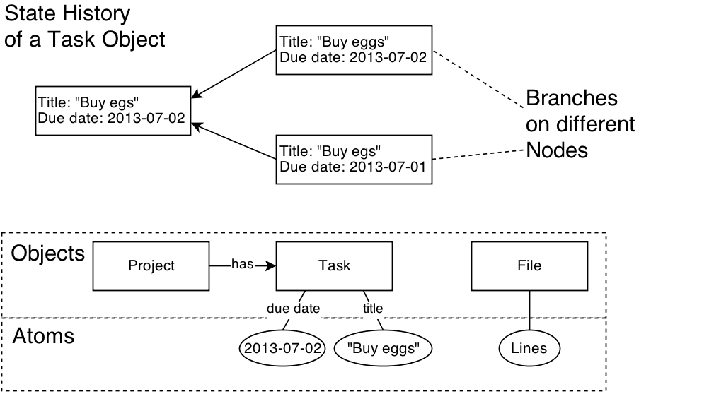
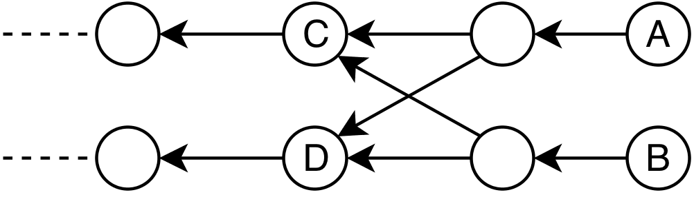

# 2 Background

We will start this chapter by explaining the core aspects of data synchronization. After setting it in context with traditional properties of distributed databases we will present popular approaches to synchronization.

Technical details on the practicality of local data storage based on HTML5 will follow. This will give us a solid background to develop and reason about our own data synchro- nization framework.

## 2.1 Defining Data Synchronization

We introduce some basic terms and systematically define data synchronization. The terminology follows that of the concurrent programming environment Erlang \[7\] and the distributed version control system Git \[1\].

**Atoms** are what we define as the lowest level of data that cannot be devided into smaller parts. Every application may have a custom definition of atoms. For a file synchronizer it may be entire files, for a source code management system it may be lines in a file, for a collaborative task manager it may be literal values like strings, numbers or dates.

Atoms can be aggregated to larger structures as **objects**. A source code management system may define objects as a sequence of lines aggregated to a file. The task manager could aggregate values like strings and dates to task objects by keeping them as ‘title’ and ‘due date’ properties. Objects can themselves be aggregated further into larger ob- jects by declaring relationships between them. File objects can be combined to directory objects, task objects into a larger structure like a project.

A collaborative application has multiple users working on different devices on a related set of data. They are either connected directly or via servers who live on the local network or the Internet. Each device, be it a user’s device or a server, we define as a **node**. Nodes can be connected through various network topologies like peer-to-peer, client-server or a hierarchical architecture. In Section 4.4 we will go into more detail about different network topologies.

The nodes of mobile users are likely to be partitioned from their network and therefore have to be able to work in **offline** mode. Therefore application data has to be available

locally so that users are not blocked from using their application. Even when connected to a network it can be beneficial to maintain data locally to increase the responseness of the application.

Objects can be edited while the node is offline. The sequence of states an object goes through as its edited is called its **history**. The history forms a directed graph with each state except the initial state having at least one ancestor. The **current state** is the one that has no descendants. As edits can be made on different devices concurrently there can be multiple **current states** at a time. If an object has multiple current states we refer to them as **branches**.

The updates across all nodes have to be **synchronized** in order to bring all branches to the same state

The process of synchronization can be divided into three phases. Local edits first have to be identified before they can be sent to other nodes. We refer to this step as the **update detection** phase. Some applications may explicitly track each edit as its made and store the history of edit operations. This **edit-based** approach is necessary for **stream-based synchronization**, which we explain in Section 2.3.

If edits are not tracked directly we have to run a differencing algorithm to detect up- dates. This requires us to keep previous states of the data and is detailed further in Section 2.4 on **history-based synchronization**.

Once updates are detected we continue with the **update propagation** phase. A stream of edit operations or the differencing output is sent to the collaborating nodes. The details will be explained in the respective sections on the stream or history based approaches.

In a final phase the received data has to be **reconceiled** with the local data on each node. Updates have to be merged and conflicts are identified. In a centralized sce- nario this part is usually carried out by the server. Distributed architectures supporting peer-to-peer synchronization are much more complex as all clients have to reconcile the received updates in an eventually consistent way.

Let us review these terms in Figure 2.1 and a short summary:

- **Atoms** are the literal values that can not be divided further.
- **Objects** aggregate atoms or other objects into larger structures.
- **Nodes** are the collaborating devices in an application.
- Updates of an object leads to multiple **states** which are linked in its **history**.
  
  
  
  Figure 2.1: The relationship of atoms, objects, nodes and the state history

- Each object can have multiple current states across multiple nodes referred to as **branches**.
- The **update detection** phase identifies local data changes on each node.
- During **update propagation** changed data is sent to collaborating nodes.
- **Reconciliation** merges data received from other nodes and identifies conflicts.

**Update detection**, **update propagation** and **update reconciliation** combined are what we define as **data synchronization**.

## 2.2 Transactions and Consistency

The nodes of a collaborative, mobile application with replicated data represent a distributed database. Distributed database systems have been a focus of research for decades. Traditionally, the incentive to make databases distributed has been to provide fault tolerance, increase read/write throughput or to increase storage capacities. Mobile applications need data replication to reduce frequent network access resulting in a better user experience. Traditional distributed databases used to back enterprise applications running entirely in server farms. Servers are connected through reliable and high-speed networks. Network partitions are the absolute exception.

On mobile devices network partitions or slow connections are the norm. Users want to work with their notebooks even when not being in an office environment with reliable Internet access. Mobile networks are still comparatively slow and unreliable.

Back in 1981 Jim Gray defined the properties of a reliable transaction system \[8\]. They are referred to as the ACID (Atomicity, Consistency, Isolation, Durability) properties - a term coined by Theo Härder and Andreas Reuter \[9\].

**Consistency** is defined as the property ensuring that a database can only transition between valid states. One way to achieve this is to use locking so that a record can not be edited concurrently. In an always-connected server environment transactions are measured in seconds - locking of data can therefore be acceptable. In a mobile setting this is not an option as transactions can easily last days. A mobile user who wants to edit some data while travelling without network connection should certainly not block all other users from doing their work. Using locking concepts in such a scenario would not only be a an inconvenience for the users but would actually lead to a high-rate of deadlocks. As Jim Gray states, the rate of deadlocks goes up with the square of the level of concurrency and the fourth power of the transaction size \[10\].

A common alternative to locking is **multiversion concurrency-control** (MVCC) where readers can still access the prior version of data being edited by another user \[11\].

With regards to the ACID property **Isolation**, MVCC refers to the most relaxed level of **“Read Uncommitted”** , which allows concurrent updates and reading of uncommitted data.

Distributed databases usually use a two-phase commit protocol to gurantee strong con- sistency \[12\]. Each participant has to agree in order to successfully complete a transaction. In a mobile setting with long periods of disconnection each commit could take hours or days to be acknowledged by all nodes. This is further complicated as nodes are often not fixed and can be added or removed from a mobile application at any time. The two-phase commit algorithm requires a coordinator node, which collects the votes of all collaborators and commits if the result is positive. In a peer-to-peer synchronization scenario with nodes unpredictably going offline this approach will not work as we can not define a reliable coordinator.

The **CAP-Theorem** actually states in detail that it is impossible to have strong con- sistency combined with partition tolerance \[13\].

Given these constraints we can only guarantee **eventual consistency**. Data will be consistently propagated across all nodes given a long enough period of time over which no changes are made. Eventual consistency is increasingly adopted in multi-master databases like CouchDB \[14\] and DynamoDB \[15\]. CouchDB, which uses a combination of MVCC and eventual consistency will be reviewed in detail in Section 5.

**Atomicity** is defined as transactions either passing entirely or leaving the database unchanged if a part fails. When choosing eventual consistency it is clear that we can not guarantee that a transaction succeeds across all nodes. Atomicity can only be guaranteed on a per-node level with transaction results eventually being propagated.

Guaranteeing **Durability** faces the same problem with nodes not being under a cen- tralized control. Durability on a global level can only be guaranteed if reliable server components are part of synchronization topology.

## 2.3 Stream-Based Synchronization

An application that tracks each edit and sends it in a stream to remote nodes follows a stream-based synchronization protocol. Stream-based synchronization is very common among real-time document editors like Google Docs.

An edit usually represents an insert or delete operation at a certain position in the text. These edit operations are broadcast to remote nodes and then “replayed”. As participating nodes can concurrently edit a document the stream of edit operations can not just be applied without modifications.

The combination of local modifications and received edit operations from a remote node requires the transformation of the remote operations in order to be correctly applied. The family of algorithms developed to correctly transform the edit operations is described as **Operational Transformation** \[16\].

If some nodes are temporarily offline while continuing to edit, the correct transformation of many concurrent edit operations becomes very complex and error-prone.

A practical problem in modern user interfaces is that it is hard to correctly capture all edits made to data. If a single edit is missed the result is a fork possibly rendering all future update operations as incorrect. Packet loss due to unreliable network connections have to be taken into account, which further complicates the design of a robust algorithm.

Research has therefore investigated options for data synchronization that do not require Operational Transformation.

**Commutative Replicated Data Types** (CRDTs) have emerged as a viable alternative for specific use cases. A recent study by Shapiro et al. presents a range of data types designed for synchronization without concurrency control \[17\].

CRDTs are designed in a way that all edit operations commute when applied in **causal order**. Section 4.3 goes into more detail about causal ordering of events. Due to the restrictions on supported operations on data types, CRDTs are only applicable in a narrow set of scenarios.

## 2.4 History-Based Synchronization

Snapshot-based methods work by tracking and relating an application’s data state over time. Instead of sending a sequential stream of raw updates, each client collects addi- tional metadata that allows more complex reasoning about the state of each client.

A prominent example is the distributed version control system **git** \[18\], which can resolve the most complex peer-to-peer synchronization scenarios.

Git achieves this by storing the entire history of a project’s database on each client. Each edit made to objects in the database is stored as a commit object and related to its ancestors.

Through the resulting commit graph each client can identify the exact subset of updates each remote node has to receive in order to be in sync.

While it sounds extremely inefficient to store the entire history of a database, git man- ages to do this in a very efficient way through a **Content Addressable Store** and data compression. It is not uncommon that the uncompressed form of the current state of a git project is larger than the project’s entire history.

## 2.5 Three-Way Merging

Three-way merging describes the concept for an algorithm that performs a merge operation on two objects based on a common ancestor.

Let **A** be the initial state of the object and let **B** and **C** be edited versions of **A**. The goal is to merge **B** and **C** into a new object **D**.

The merge algorithm starts by identifying the differences between **A** and **B** and between **A** and **C**.

All parts of object **B** that are neither changed in **B** nor in **C** are carried over into **D**. All changes to parts of the object in **B** that have not been changed in **C** are directly accepted and added to **D**. Same is true for changes to objects in **C**, which have not been changed in **B**.

If the same parts are edited both in **B** and **C** we have a merge conflict that needs to be resolved.

Figure 2.2 shows a simple scenario where a merge can be successfully made. In Figure 2.3 we have concurrent edits of the same property resulting in a conflict.

Figure 2.2: A successful three-way merge

Figure 2.3: Concurrent updates of the same property result in a conflict

There is no universal algorithm for resolving conflicts. Different types of data and applications require different types of conflict resolution strategies. In many cases conflict resolution can not even be done in an automated way but has to be left to the user of an application.

Even the term **three-way merging** only describes a general concept but the actual algorithm will differ based on the type of objects that are merged. Text files are the most common type of object with lines seen as the **parts**. The unix program **diff3** implements a three-way merge variant for text files \[19\].

Most modern version control systems implement three-way merging to allow lock-free collaboration on source code. **Git** applies three-way merging not only for text files but for entire file system trees \[1\].

With git we have a great example of a hierarchical conflict resolution strategy:

- If two developers concurrently edit the same directory git tries to resolve this conflict by descending into the directory and looking at individual files.
- If the developers edited different files git can automatically resolve the conflict by accepting both changes.
- If the same file was edited concurrently git tries to descend a level deeper by looking at edits made to individual lines.
- If different lines were edited concurrently it can again resolve the conflict by accepting both changes.
- Only in the unlikely event that both developers edited the same line git has no way to automatically resolve the conflict. It will delegate the conflict resolution to the developers who will have to manually merge both changes.

Tancred Lindholm designed a three-way merging algorithm for XML-documents. With the **3DM** tool there is even an implementation available \[20\]. As XML supports the expression of a broad range of data types this is probably one of the most generic implementations.

## 2.6 Lowest Common Ancestor

As described in Section 2.1 the changing states of an object being updated are linked in its state **history**. Each object state links back to its ancestor thereby forming a directed acyclic graph.

The lowest common ancestor (LCA) of two states A and B in the history graph is defined as the common ancestor C with the lowest distance to A and B. The distance between two states is defined as the number of edges between them.

Figure 2.4: C is the lowest common ancestor of A and B

Figure 2.4 shows an example where A and B have two common ancestors C and D but only C being the lowest common ancestor.

There are cases where the LCA is ambigous - in Figure 2.5 both C and D have the same distance to A and B.

Figure 2.5: Both C and D are lowest common ancestors of A and B

The LCA problem has long been solved through various approaches. Czumaj et al. presented a simple method solving the problem on _n_ nodes and _m_ edges in O(_n_ ∗ _m_) \[21\].

An alternative approach by Bender et al. is able to compute LCA queries in constant time after O(_n_3) pre-processing step \[22\].

## 2.7 Content Adressable Storage

A content adressable store (CAS) allows data to be retrieved based on its content rather than by its location. When writing an object typically a cryptographic hash function is used to compute its hash. The hash then becomes the address of the object under which it is written. It implies that data objects are always copied on write as their storage location is defined by its content. The ZFS filesystem uses this concept internally to achieve fast snapshotting and strong data verification \[23\].

Creating a snapshot of an object does not require any copying - the filesystem only has to keep the current version of the object as updates are made.

Data verification is given for free as well - an object can simply be re-hashed on a read and compared to the hash its stored at.

Git is another system making use of a CAS as it needs to keep all previous versions of each object \[18\].

Our own synchronization framework described in Chapter 6 will use the concept of a CAS.

## 2.8 HTML5 and Offline Applications

HTML5 specifies a number of client-side storage options. Most are a work in process and still have to be adopted by all browser vendors. IndexedDB is most likely going to be the standard for building offline-capable web applications. Combined with Cache Manifests, HTML5 provides all the tools necessary for building offline applications.

### 2.8.1 Web Storage

The simplest API is the **localStorage** standard defined in the W3C’s Web Storage specification \[24\].

It provides a key-value store accessible from JavaScript, which can store string values for string keys. Most browsers currently set a storage limit of 5 MB per site. **LocalStorage** is therefore only suitable for storing small volumes of data.

Another limitation is the interface, which is synchronous. As JavaScript is single- threaded, every read or write operation will block the entire application. Frequent or large-volume read/write operations can result in a bad user experience caused by a “freezing” user-interface.

**LocalStorage** is currently supported by all major browsers including its mobile vari- ants.

### 2.8.2 Web SQL Database

A much more advanced implementation is specified by the now deprecated **Web SQL** standard \[25\]. It defines a relational database similar to Sqlite including SQL support. The proposal was strongly opposed by the Mozilla Foundation, which sees a SQL-based database as a bad fit for web applications \[26\].

The standard was therefore only implemented by Google Chrome, Safari and Opera and their mobile counterparts in Android and iOS.

**Web SQL** has been officially deprecated by the W3C and support by browsers is likely going to drop in the future.

### 2.8.3 Indexed Database

Instead of Web SQL the standard favored by the W3C and most browser vendors is **IndexedDB** \[27\].

**IndexedDB** defines a lower-level interface for storing key/value pairs and setting up custom indexes. While relatively simple, the API design is generic enough to cater for implementations of more complex databases on top. It would, for example, be possible to implement a **Web SQL** database using **IndexedDB**.

IndexedDB supports storing large amounts of data and defines an asynchronous API. Unfortunately the standard has not yet been implemented across all major browsers. It is currently available in Mozilla Firefox, Google Chrome and Internet Explorer. Safari support is still missing as well as support in the default Android and iOS browser.

Luckily most browsers who have not implemented IndexedDB yet, are still supporting Web SQL. There is a polyfill available that implements an IndexedDB interface using Web SQL \[28\]. Application developers can therefore already base their work on the IndexedDB interface while browser vendors are catching up.

### 2.8.4 Cache Manifests

To truely work offline, an application has to make its static resources available locally as well. The **cache manifest** defined in the HTML standard gives developers the right tool \[29\]. It allows you to define a local cache of all application resources like HTML, CSS, JavaScript code or other static files.

Flexible policies give fine-grained control over which resources should be available offline and which need network connection.