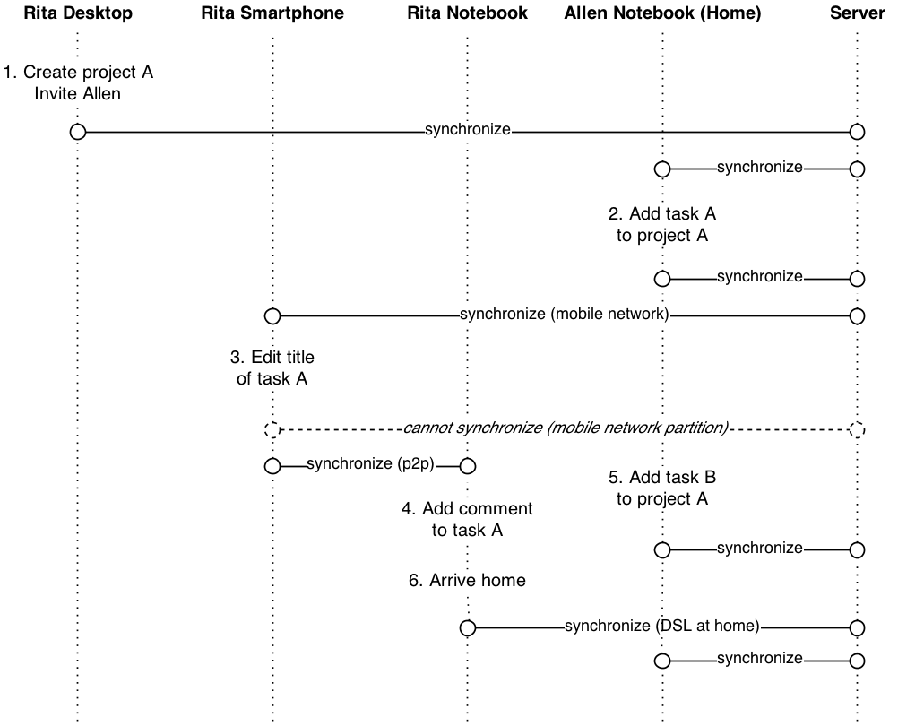

# 3 Application Scenario - A Collaborative Task Manager

Our goal is to develop a collaborative Task Manager that can still be used if disconnected from the network and satisfies the requirements described in the following. We choose this scenario because we think it represents a common type of architecture and data model for mobile applications. The application described here will form the base of our requirements analysis in the next chapter.

Let us first work out some user stories and then try to define a suitable data model for such an application.

## 3.1 User Story 1: Creating Projects

- All **Users** are part of an organization.
- A **User** can create **Projects** in order to coordinate **Tasks**.
- A **User** can invite other **Users** which are part of the same **Organization** as **Members** to a **Project**.

Examples for **Projects** created by User Rita would be:

| Project | Name Members |
| ------- | ------------ |
| Marketing Material | Rita, Tom, Allen |
| Product Roadmap | Rita, Allen |
| Sales Review | Rita, Lisa |

## 3.2 User Story 2: Creating and Editing Tasks

- **Project Members** can add **Tasks** to a **Project** in order to manage responsibilities.
- A **Task** can have a due date and a responsible **Member** assigned.
- A **Task** can be edited by **Members** and marked as done.
- A **Task** can be moved to different positions in a list.

An example list of *Tasks* could be:

Project “Marketing Material”

| Task | Due Date | Assignee | Done |
| ---- | -------- | -------- | ---- |
| Create event poster | 2013-08-12 | Rita | No |
| Write blog entry on event | 2013-07-20 | Tom | Yes |

## 3.3 User Story 3: Commenting on Tasks

- **Members** can add **Comments** to **Tasks**.

Examples would be:

Task “Create event poster” in Project “Marketing Material"

| Member | Date | Comment |
| --- | --- | --- |
| Rita | 2013-07-20 | Allen, I need you to create some graphics. |
| Allen | 2014-07-20 | Ok, lets go through it tomorrow morning! |

## 3.4 User Story 4: User Workflows

- In order to be productive a user needs to access all **Tasks** from any device.
- A user should be able to edit and create **Projects** and **Tasks** when disconnected from any network.
- The data should be kept as current as possible even if a user’s device does not have reliable Internet access.

3 Application Scenario - A Collaborative Task Manager

Figure 3.1: An exemplaric workflow that should be supported by our application

Figure 3.1 demonstrates a workflow that should be supported:

1. Rita works at the desktop computer in her office with high-speed Internet access. She creates project A and invites Allen.
2. Allen works from home on his notebook with high-speed Internet access. He reviews project A and creates task A1.
3. Rita is already on her way home but has mobile Internet access on her smartphone. She receives the added task A1 and edits its title.
4. Rita is still on the train but decides to continue working on her notebook. Her notebook does not have Internet access but she can establish a direct connection to her smartphone via Wifi. The reception on her smartphone has dropped in the meanwhile. She receives the latest updates from her smartphone and adds a comment to task A1.
5. Allen who is still at home can not receive Rita’s comment as she is still on the train. In the meanwhile he creates a task A2 in project A.
6. Rite gets home where she has Internet access with her notebook. She receives Allen’s created task A2.
7. Allen, who is still at his notebook, receives Rita’s comment as soon as she connects to Internet at home.

## 3.5 Data Schema

Based on the user stories we derive a data schema for the application. We map it to an entity-relationship schema as shown in Figure 3.2.

The only complication is the requirement of **Tasks** per **Project** being ordered. We model this as a linked list by having a “Next Task” relationship.

Figure 3.2: A collaborative Task Manager’s data schema