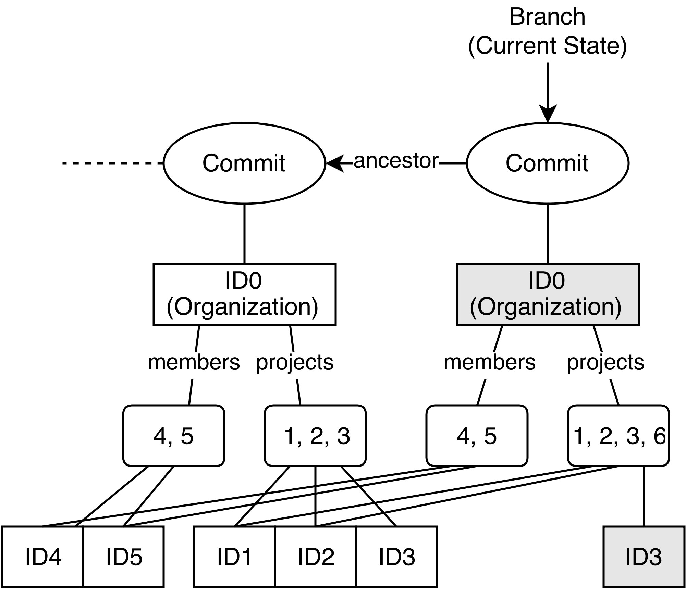

# 6 Architecture of Histo

Based on the requirements and the evaluation of CouchDB we derive a new architecture for a practical synchronization solution we call Histo. We develop Histo driven by our application scenario and demonstrate the components using exemplaric data of our use case.

As a first step we describe the mapping of an application’s data model to a hierarchy, which brings the data in a format that can be efficiently differenced.

We will then show in Section 6.2 how the change history of our hierachical data model can be persisted while minimizing the amount of redundant data.

This forms the basis of our synchronization protocol in Section 6.3, which describes the data propagation and merging from a high-level perspective.

Section 6.4 dives deeper into the internals of the data propagation phase.

The most involved part of our protocol is the three-way merging phase which happens locally on each node. Section 6.5 goes into great detail on how we implement this phase by applying differencing and merging algorithms.

The section on merging will reveal potential conflicts that can arise - strategies to handle these will be discussed in Section 6.6.

One of our requirements is the support of flexible network topologies. In Section 6.7 we evaluate the support for a range of topologies and outline possible optimizations of the protocol for each of these.

## 6.1 Hierarchical Data Model Mapping

Our data described in the scenario is structured through entity instances, their attribute values and relationships to other instances. Most modern web application frameworks realize one-to-one relationships, by simply having an attribute storing the related in- stance’s ID. One-to-many relationships are realized through an attribute having a collection of instance IDs as its value.

Instance collections often have a relevant order that needs to be preserved. An example is the list of tasks in a project that is displayed to the user. The user wants to be able to change the order of tasks and the order should be persisted.

We further differentiate between linking to a separately stored instance and embedding an instance. An embedded instance can still be linked from other instances but it cannot be embedded twice. Linking to an instance means to simply hold another instance’s ID as an attribute value, embedding means to hold both their ID and actual state.

The merge and commit processes, described in the next sections, depend on a hierarchical representation of our application state. To have a hierarchy we need to define a single root structure, from where all substructures of our state can be reached.

Our hierarchical structure can be as simple as this:

- Level 0 (Root): list of entities
- Level 1: list of instances per entity
- Level 2: list of attributes per instance

This gives us a very flat tree with each entity node linking to a potentially large number of instances. For example, our comments entity would directly link to all comments across all projects and tasks. The next sections will show that it is beneficial for merging performance if each tree node only links to a small number of child nodes.

This is where the difference between linking and embedding comes into play. We can achieve a deeper hierarchy by embedding certain instances in others. In our scenario we could decide to embed tasks inside projects through one of its attributes. Comments could in turn be embedded inside tasks.

In order to develop a merging algorithm we need to map each substructure of our hierarchy to a suitable data structure.

Starting at the top we choose the list of projects as the root structure of our data. The project list is represented through a **dictionary** embedding all project instances. The dictionary keys are the instance IDs and the dictionary values embed the actual instances.

Each instance is again represented through a **dictionary**. The dictionary keys correspond to the attributes and the dictionary values to attribute values.

If the attribute values are atoms, the hierarchy stops here. Attributes with string values can be represented with **ordered lists**. Attribute values linking to other instances are represented through **(ordered) sets**. We can choose a set as the list can only contain unique instance IDs.

Attribute values embedding other instances are represented through an **(ordered) dic- tionary**. Like in our project list at the beginning, keys are the IDs of instances and values their actual state.

If other instances are embedded, they are kept as children in the hierarchy.

Let us summarize the full mapping between model elements and data structures:

- Instances and their attributes: dictionaries
- String values: ordered lists
- Collections linking to instances: (ordered) sets
- Collections embedding instances: (ordered) dictionaries


Figure 6.1: The data model mapped to a hierarchy.

Figure 6.1 shows the actual hierarchy we derived from the data model in our scenario.

## 6.2 Committing Objects

We have seen how through the use of object embedding we can structure our data hierarchically. When persisting our data we do not actually physically embed entire objects down the hierarchy. If we did this we would end up with a single, big structure which would have to be re-written every time a small change was made. We therefore store even embedded objects as separate structures. At a logical level they are still embedded though - we achieve this through the use of cryptographic hashing. All of our objects are stored in a content-addressable store which is described in Section 2.7. Existing objects are never overwritten - a new version is written instead. We can retrieve each object based on a cryptographic hash of its content. When logically embedding an object we actually save it in the store and only reference its hash.

Saving each object separately we can now re-use objects of previous states when new data is commited. As shown in Figure 6.2 each data update is represented through a new commit object. Each commit object points to the root of the data hierarchy and therefore to a snapshot of the entire data. Commit objects link to their parent commits and are therefore connected in a directed, acyclic graph.

Commit objects themselves are stored separately in a content-addressable store. They reference the root of the data hierarchy through the hash of the root object. Ancestor commits are simply referenced through their hash as well.

Whenever an object in our graph changes, we only need to write the changed object and all its parents again. All unchanged objects can be referenced again through their state hash. If we run a commit and no data has actually changed, we therefore do not write any new object versions to the store.



Figure 6.2: Re-using objects across commits.

Let us go through the steps of an exemplary update which could have lead to the scenario shown in figure 6.2:

1. A new task with ID10 is added to project ID3 and committed.
2. Task ID10’s state is written to the content-addressable store, which returns its cryptographic hash.
3. Project ID3, which embeds Task ID10 references the new hash in its ‘tasks’ at- tribute, Task ID9 is unchanged and can therefore be referenced without writing it again.
   
   The new state of Project ID3 has to be written again returning its new hash.
4. Organization ID0 embeds Project ID3 and therefore has to update the hash in its ‘projects’ attribute to the new version.
   
   All other projects and entries of the ‘members’ attribute can reference to the previous instance hashes without writing them again.
5. The new commit object links to the new hash of organization ID0 as the root object.
6. The new commit object links to the previous commit object.

With this model of hierarchical data at hand we can now go into the details of merging two branches of our state.

## 6.3 Synchronization Protocol

Synchronization always happens from a **source** node to a **target** node. If it is run simultaneously with source and target exchanged, it keeps both nodes in sync with each other.

The algorithm is designed to be able to run independently of the source or target. It could be implemented as a separate application, possibly even running on a different device - as long as it has access to both the source and target node.

The synchronizer could be run in regular intervals or explicitly triggered by changes in the source node. Our solution therefore shares high-level characteristics with CouchDB’s solution described in Section 5.2.

The latest commit on a node we refer to as its **head**. A node has a **master head**, which refers to the version of the data considered to be ‘true’ by the node.

For each remote node it synchronizes with, the node keeps a **remote tracking head**. A remote tracking head represents what the local node considers to be the current state of a remote node.

Before each synchronization, both nodes should commit their latest changes as described in Section 6.2. Commits snapshot the state of our data as we start synchronizing. Between synchronizations they do not have to be run on every change of data. The commit history therefore marks the history of synchronizations between nodes. Every commit corresponds to the state of one or more synchronizations.

Synchronization follows a two-step protocol, step one propagates all changed data from source to target, step two executes a local merge operation.

### 6.3.1 Update Detection and Propagation

The combination of update detection and propagation follows the following protocol:

1. Read the target’s remote tracking head of source.
2. Read all commit IDs since the target’s remote tracking head from source and write them to target.
3. Let the target compute the common ancestor commit ID of target’s and source’s master heads.
4. Read all changed data since the common ancestor commit from source and write to target.
5. Set the target’s remote tracking head of source to source’s master head.

Once these steps are executed, the target node has the current state of source available locally.

The target’s head still refers to the same state as the source data has not been merged. 

Listing 6.1 summarizes the protocol as pseudo-code.

```js
sourceHead = source.head.master
targetHead = target.head.master
lastSyncedCommit = target.getRemoteTrackingHead(source.id)

commitIDssource = source.getCommitDifference(lastSyncedCommit, sourceHead)

target.writeCommitIDs(commitIDssource)

commonAncestor = target.getCommonAncestor(targetHead, sourceHead)

changedData = source.getDataDifference(commonAncestor, sourceHead)

target.writeData(changedData)

target.setRemoteTrackingHead(source.id,sourceHead)
```

Listing 6.1: Detecting updates across nodes and propagating the changes.

The functions ‘getCommitDifference()’ and ‘getDataDifference()’ are implemented as described in Section 6.4.

The most recent common ancestor algorithm used in ‘getCommonAncestor()’ is described in Section 2.6.

The internals used by ‘writeData()’ and the underlying commit data model have been explained in Section 6.2.

Note that keeping the remote tracking head is optional. The protocol still succeeds if the remote head is unknown or rembered wrong. Section 6.7.3 will illustrate this for a multi-master topology.

### Robustness

The data propagation protocol can fail at any point without leaving either node in an inconsistent state. The phase does not override any data on the nodes besides the remote tracking head on the target. If the protocol fails before updating the remote tracking head, it simply has to be repeated.

### 6.3.2 Merging

Even if the source is disconnected at the merging stage, the target has all the necessary information to process the merge offline.

The target’s master head we refer to as the **master head**. The target’s remote tracking branch for the source we refer to as the **source tracking head**. From a high-level the algorithm can be described as the following:

1. Compute the common ancestor of the master head and the source tracking head. (The common ancestor could also be re-used from the propagation step.)
2. If the common ancestor equals the source tracking head:
   
   The source has not changed since the last synchronization. The master head is ahead of the source tracking head.
   
   The algorithm can stop here.

3. If the common ancestor equals the master head:
   The target has not changed since the last synchronization. The source’s head is ahead of target.
   We can fast-forward the master head to the source tracking head.
4. If the common ancestor is neither the source tracking head nor the master head: Both source and target must have changed data since the last synchronization. We run a three-way merge of the common ancestor, source tracking head and master head.
   
   We commit the result as the new master head.

This protocol is able to minimize the amount of data sent between synchronized nodes even in a distributed, peer-to-peer setting. Section 6.7 will look at the protocol’s support of various network topologies.

Updating the target’s head uses optimistic locking. To update the head you need to include the last read head in your request. So both the fast-forward operation or the commit of a merge result can be rejected if the target has been updated in the meantime.

If this happens the Synchronizer simply has to re-run the merge algorithm.

In Figure 6.2, the merging process is described using pseudo-code.

Its core is the call to ‘three-way-merge()’ - the details of our three-way merging concepts are described in Section 6.5.


```js
masterHead = target.head.master
sourceTrackingHead = target.head.sourceID

commonAncestor = target.getCommonAncestor(masterHead, sourceTrackingHead)

if (commonAncestor == sourceTrackingHead) {
    // donothing

}
elseif(commonAncestor == masterHead) {
    // fast-forwardmasterhead
    try {
        // when updating the head we have to passin the previous head:
        target.setHead(sourceTrackingHead, masterHead)
    } catch {
        // the master head has been updated in the meantime
        // startover
    }

} else {
    commonAncestorData = target.getData(commonAncestor)
    sourceHeadData = target.getData(sourceTrackingHead)
    targetHeadData = target.getData(masterHead)

    mergedData = three - way - merge(commonAncestorData, sourceHeadData,
        targetHeadData)

    // commit object linking commitdata with it sancestors:
    commitObject = createCommit(mergedData, [masterHead, sourceTrackingHead])
    try {
        // when updating the head we have to passin the previous head:
        target.commit(commitObject, masterHead)
    } catch {
        // themasterheadhasbeen updated in the meantime
        // startover
    }
}
```

Listing 6.2: Merging Protocol

The protocol described here only propagates the changes from the source to the target node. To actually synchronize both nodes to the same state, the protocol has to be run in the reverse direction as well.

### Robustness

Running the protocol in both directions is not an atomic operation. It is therefore possible that both nodes do not end up with the exact same state as updates to the data can be made on both nodes at any time. The nodes are only consistent if both nodes do not change any data while the synchronization takes place. This is actually part of our requirements of supporting optimistic synchronization and to only guarantee eventual consistency, which are defined in Section 4.2.

The merging protocol is unlikely to fail as it runs entirely on the local node without requiring error-prone network communication. In case of the fast-forward merge, only the local head is updated to the source tracking head. This operation can fail if the local head was updated in the meantime. The merge protocol then simply has to be repeated.

A failure in the three-way-merge call (line 25) does not corrupt any data, as the local head remains unchanged. Only after a successful merge, a new commit object is created and the local head is updated. Again, there can be a failure if the local head has been updated while the merge operation is running. In this case the merge protocol is repeated as well to include the latest changes in the merge. Note that in any case of failure, only the merge protcol has to be repeated but not the comparatively long- running data propagation protocol.

## 6.4 Update Detection Between Branches

The change detection phase of our synchronization protocol is defined through the calls ‘getCommitDifference()’ and ‘getDataDifference()’. We will now look into the internals of the algorithms invoked through these calls.

### 6.4.1 Commit History Difference

Identifying added commit IDs since a last known synchronized commit is only working on the meta-data level - there is no application data involved in this phase.

Given two branches A and B we want to retrieve all commits A needs in order to be in sync with B. Our algorithm is based on the recursive invocation of a lowest common ancestor implementation:

1. Compute the lowest common ancestor of commit A and B.
2. Add commit B to the result.
3. Walk up the ancestor chain of commit B, adding all commits to the result unless:
4. The common ancestor is reached - then return the result.
5. If a commit has multiple ancestors - then invoke the algorithm again with each ancestor as commit B.

Add the result of the recursive invocation to the final result.

We can express this more concretely using pseudo-code:

```js
function getCommitDifference(commitA, commitB) {
    result = [commitB]

    commonAncestor = getCommonAncestor(commitA, commitB)

    while (commitB.hasOnlySingleAncestor()) {
        singleAncestor = commitB.getAncestors()[0]

        if (singleAncestor == commonAncestor) {
            return result
        }

        result.push(singleAncestor)

        commitB = singleAncestor
    }

    ancestors = commitB.getAncestors()
    if (ancestors.length == 0) {
        returnresult
    }

    for (eachancestorinancestors) {
        forkResult = getCommitDifference(commitA, ancestor)
        result.append(forkResult)
    }

    return result
}
```

Listing 6.3: Detecting commit history difference


Figure 6.3: Commit difference between branches B and C and A being the last synchronized commit.

Figure 6.3 visualizes the commit difference for two branches B and C. The last syn- chronized commit is A. B has in the meantime made concurrent changes and it has synchronized with another branch D. Branch D has not been synchronized with branch C. The commit difference between A and B is therefore the sum of two commit paths:

- The shortest commit path between B and the lowest common ancestor of A and B, which is B.
- The shortest commit path between D and the lowest common ancestor of D and A, which is E.

We want to ensure that if ‘commitA’ is not part of the history, the entire history of ‘commitB’ is returned. ‘getCommonAncestor()’ therefore has to return the root of the history if no common ancestor is found. This is the reason for the exit condition on line 19 where commitB has reached the root of the history.

### 6.4.2 Application Data Change Detection

Having extracted the list of commits that need to be propagated we can now trace what data has been changed through these.

In Section 6.2 we explained how each object is stored separately under its cryptographic hash. Existing objects are never updated in-place - we therefore only have to identify which objects have been added to the store.

We identify updated objects on a per-commit basis comparing each commit’s state with its ancestors. Starting at the root object referenced by the commit we recursively difference the hierarchy with the commit’s ancestor:

```js
function getDataDifference(rootObjectHash, ancestorRootObjectHash) {
    result = []

    if (rootObjectHash == ancestorRootObjectHash) {
        returnresult
    }

    result.push(rootObjectHash)

    rootObject = store.read(rootObjectHash)
    ancestorRootObject = store.read(ancestorRootObjectHash)
    rootChildren = rootObject.getChildDictionary()
    ancestorChildren = ancestorRootObject.getChildDictionary()

    childDifference = getDictionaryDifference(ancestorChildren, rootChildren)

    for (each insertedChildHash in childDifference.inserts) {
        insertedChildAllChildren = getChildrenRecursive(insertedChildHash)
        result.push(insertedChildHash)
        result.concat(insertedChildsAllChildren)
    }

    for (each update in childDifference.updates) {
        updated ChildHash = update.new
        updatedAncestorChildHash = update.ancestor
        childResult = getDataDifference(updatedChildHash,
            updatedAncestorChildHash)
        result.concat(childResult)
    }
    returnresult
}
```

Listing 6.4: Detecting data difference across commits

In our scenario the children correspond to embedded instances as we defined them in Section 6.1. While in our data model we differentiate between instances belonging to certain attributes this is not relevant for the data difference algorithm. We simply flat- ten the embedded child instances across all attributes to a single dictionary of children. The dictionary difference algorithm that is used in the ‘getDictionaryDifference()’ call is explained in Section 6.5.2. In the context of this section it is used for merging but we can re-use the algorithm for our purpose here.

Through the combination of the commit and data difference algorithms we now have the tools to implement the update detection and update propagation steps of our synchronization protocol as described in Section 6.3.

## 6.5 Reconciliation Through Three-Way Merging

In this section we will focus on three-way merging, which is part of the reconciliation phase of our protocol developed in Section 6.3.1.

All necessary data for a merge has already been propagated from the source to the target node. We have all information about the current state and the commit history of the source node available locally. The current state is marked through the source tracking branch as described in Section 6.3.2. The entire merging process can therefore happen offline without the need of any communication with the source node.

Our three-way merge algorithm is structured into three types of processes, which are recursively executed on our data hierarchy:

- **Differencing**: we diff branch B and C with their common ancestor A.
- **Merging**: we merge the two diffs A-B and A-C to a new diff result.
- **Patching**: we apply the merged diffs as a patch to A, which results in the merged state D.

Our current branch we refer to as B and the source tracking branch as C. The common ancestor of B and C is defined as A.

Starting with a differencing phase we identify the changes made in the branches B and C since our common ancestor state A.

If follows a diff merging phase where the two diff results A-B and A-C are combined into one diff. As its only input is the two diffs it does not require access to the actual states A, B or C. In this phase conflicts can appearch if the two branches contain updates to the same parts of the state.

The merged diff can then be applied to the origin state A in order to create the actual merged state. For this step we require a patch algorithm.

These three steps are actually applied to each hierarchy level or our state. In the next section we give concrete examples of what the expected output of each level should be. Based on the examples we will then look into implementation details of the respective algorithms.

### 6.5.1 Merge Scenario

To show correctness and completeness of a merge algorithm we need to define sample model states with expected merge results. This set of data can then be used as a test case for our implementation. Based on an ancestor state all users start with, we define several possible branch states.

Merging of the branch states will happen at multiple levels of detail corresponding to our data hierarchy. Each level will have its own difference and diff merge phase. The result of the diff merge phases is then used to patch the common ancestor state.

The difference and merge algorithms that need to be applied will vary on each level depending on the data structures used. The sample data is defined so that we can demonstrate each possible data structure that we mapped to in Section 6.1 (dictionar- ies, ordered dictionaries, ordered sets and ordered lists).

The root of our state is defined through an organization instance. All other instances can be reached from it. As defined in Section 6.1, we differentiate between linking and embedding of instances. Linking is done by only referencing an instance’s ID, embedding is done by referencing its actual state hash along with the ID.

#### Ancestor state A of organizations

| ID | Hash | Members (embedded) | Projects (embedded) |
| --- | --- | ------------------ | ------------------- |
| 0 | O0A | 1: U1A | 4: P4A |
|   |     | 2: U2A | 5: P5A |
|   |     | 3: U3A | 6: P6A |
|   |     |        | 7: P7A |

For completeness we include the state of embedded user instances - they will not be modified in this example:

#### Ancestor state A of users

| ID  | Hash | Name |
| --- | --- | --- |
| 1   | U1A | Rita |
| 2   | U2A | Tom |
| 3   | U3A | Allen |

The projects embedded in the organization show the difference between linking (mem- bers) and embedding (projects):

#### Ancestor state A of projects

| ID  | Hash | Project Name | Members (linked) | Tasks (embedded, ordered) |
| --- | --- | --- | --- | --- |
| 4   | P1A | Marketng Material | 1, 2, 3 | 8: T8A |
|     |     |     |     | 9: T9A |
|     |     |     |     | 10: T9A |
|     |     |     |     | 11: T11A |
| 5   | P5A | Product Roadmap | 1, 3 | 12: T12A |
| 6   | P6A | Staffing | 1   | 13: T13A |
|     |     |     |     | 14: T14A |
| 7   | P7A | Finances | 3   | 15: T15A |

We will leave out the details on the state of other entities (tasks and comments) as the instances shown so far already cover all required modeling aspects.

The state has been modified resulting in a new state in branch B:

#### State B of organizations

| ID  | Hash | Members (embedded) | Projects (embedded) |
| --- | --- | --- | --- |
| 0   | O0AB | 1: U1A | 4: P4A |
|     |     | 2: U2A | 5: P5A |
|     |     | 3: U3A | 6: P6A |
|     |     |        | 7: P7A |

#### State B of projects

| ID  | Hash | Project Name | Members (linked) | Tasks (embedded, ordered) |
| --- | --- | --- | --- | --- |
| 4   | P1AB | Marketing Material | 1, 2 | 8: T8A |
|     |     |     |     | 11: T11A |
|     |     |     |     | 9: T9A |
|     |     |     |     | 10: T9A |
|     |     |     |     | 17: T17B |
| 5   | P5AB | Product Roadmap | 1, 3 | 12: T12A |
| 6   | P6A | Staffing  | 1 | 13: T13A |
|     |     |     |     | 14: T14A |
| 7   | P7A | Finances  | 3 | 15: T15A |
|     |     |     |     | 18: T18B |
| 16  | P16B | Sales Planning | 1, 2 |     |

Through concurrent updates branch C emerged - its state is defined as the following:

#### Ancestor state C of organizations

| ID  | Hash | Members (embedded) | Projects (embedded) |
| --- | --- | --- | --- |
| 0   | O0AC | 1: U1A | 4: P4AC   |
|     |      | 2: U2A | 5: P5AC   |
|     |      | 3: U3A |           |

#### State C of projects

| ID  | Hash | Project Name | Members (linked) | Tasks (embedded, ordered) |
| --- | --- | --- | --- | --- |
| 4   | P1AC | Marketing Strategy | 1, 2, 3 | 11: T11A |
|     |      |                    |         | 8: T8A   |
|     |      |                    |         | 9: T9A   |
|     |      |                    |         | 10: T9A   |
| 5   | P5AC | Product Strategy   | 1, 3    | 12: T12A  |
|     |      |                    |         | 19: T19C  |

We start the merging process with the root instance hashs:

#### Organization difference

| ID | State A | State B | State C | Result |
| --- | --- | --- | --- | --- |
| 0   | O0A | O0AB | O0AC | conflict (concurrent update) |

Both B and C have obviously modified the content of our organization in different ways resulting in a conflict.

We will try to resolve this conflict by differencing the data on a more detailed level. The value of the ‘members’ attribute has not been modified - we therefore look at the difference of the ‘projects’ attribute:

#### ‘Projects’ attribute difference of organization ID 0

| ID  | State A | State B | State C | Result |
| --- | --- | --- | --- | --- |
| 4   | P4A | P4AB | P4AC | conflict (concurrent update) |
| 5   | P5A | P5AB | P5AC | conflict (concurrent update) |
| 6   | P6A | P6A | -   | remove |
| 7   | P7A | P7AB | -   | conflict (concurrent update and remove) |
| 16  | -   | P16B | -   | insert |

Whenever the hash of an instance has only changed in one state, we carry the change over into the result. If the hash has changed in both states, we have a conflict. This merging phase will be implemented through difference and merge algorithms for dictionaries.

We will try to resolve conflicts by running a finer grained merge on the conflicting instance states. ID 4 and ID 5 will therefore go into a lower level of merging while the changes in ID 6 and 16 are already accepted. We cannot run a finer grained merge on ID 7 as it was removed in state C. This conflict can therefore not be resolved and directly carried into the result.

Lets see if we can resolve conflicts 4 and 5 in the next merge. At this level we will again look at individual attributes to find out which are actually affected by the updates.

#### Attribute difference of task ID 4

| Attribute | State A Hash | State B Hash | State C Hash | Result |
| --- | --- | --- | --- | --- |
| Project Name | Markting Material | Marketing Material | Marketing Strateqy | conflict |
| Members | 1, 2, 3 | 1, 2 | 1, 2, 3 | update |
| Tasks | 8: T8A | 8: T8A | 11: T11A | conflict |
|     | 9: T9A | 11: T11A | 8: T8A |     |
|     | 10: T9A | 9: T9A | 9: T9A |     |
|     | 11: T11A | 10: T9A | 10: T9A |     |
|     |     | 17: T17B |     |     |

At this level we can already carry over the update of the ‘Members’ attribute in B to the result. Note that if we had a conflict here, we would have run an ordered set difference and merge algorithm as it is shown later as part of the ordered dictionary algorithms. The ‘Project Name’ and ‘Tasks’ attributes of B and C have been concurrently updated and are therefore in conflict. This difference and merge step can again be realized with an algorithm for dictionaries (keys being attributes, values being attribute values).

If we define string values as atoms we have reached the most detailed level of merging for ‘Project Name’ - the conflict will therefore be carried over into the result. If we instead see strings as another substructure we can attempt to resolve the conflict by using a string merging algorithm.

We have mapped the embedded and ordered ‘Tasks’ attribute to an ordered dictionary data structure. We can therefore try to resolve the conflict by applying a merge algorithm for ordered dictionaries.

We will now describe the result we expect from merging the ‘Project Name’ strings. Note that all index positions in the following diffs are seen as relative to the ancestor state. So even if one diff contains multiple insert or remove operations they are given as if they were all applied simultaneously to the ancestor state.

#### ‘Project Name’ difference for project ID 4

| Diff A-B | Diff A-C | Diffs Merged |
| -------- | -------- | -------------|
| insert ‘i’ behind index 5 | insert ‘i’ behind index 5 | insert ‘i’ behind index 5 |
|      | remove from index 9 to 17 | remove from index 9 to 17

Applying this merge result to the ancestor state gives us an intuitive result: ‘Marketing Strategy’.

To merge the ordered dictionary structure representing the ‘Tasks’ attribute we will apply two separate merge steps:

- Order merge: We can merge the order by using the keys of the ordered dictionary as an ordered set and applying an ordered set merge algorithm.
- Value merge: The values are merged by applying an ordinary dictionary merge algorithm.

The expected output of the order merge for the ‘Tasks’ attribute:

#### ‘Tasks’ order difference for project ID 4

| Diff A-B | Diff A-C | Diffs Merged |
| -------- | -------- | ------------ |
| move index 3 behind index 0 | move index 3 behind index -1 | insert 6 behind index 3 conflict (‘move index 3 behind index 0’ and ‘move index 3 behind index -1’) |
| insert 6 behind index 3 |    |    |

We have been able to carry over one operation into the result while we still have an update conflict. There is no way we can do an even finer grained merge to resolve this conflict. The application developer will have to implement a custom merge solution - possibly even asking the user which operation to choose.

Depending on how the conflict is resolved, possible results are:

- 8, 11, 9, 10, 17
- 11, 8, 9, 10, 17

The value merge works analog to the merge we did for the ‘Projects’ attribute in the organization instance. We will skip this phase as none of the tasks have been updated.

The merge of ID 5 works analogous - we will therefore skip the attribute merging step and jump right into the string merge:

#### ‘Project Name’ difference of project ID 5

| Diff A-B | Diff A-C | Diffs Merged |
| -------- | -------- | ------------ |
| remove from index 8 to 15 | remove from index 8 to 15 | remove from index 8 to 15  |
| insert ‘Planning’ behind index 7 | insert ‘Strategy’ behind index 7 | insert ‘Planning’ behind index 7 |
|   |   | insert ‘Strategy’ behind index 7 |

We have applied the same merge logic that helped us resolve the name conflict in project ID 4. But the result we get here is not what a user would expect. Applying the merged operations to the ancestor state results in: ‘Product StrategyPlanning’.

This is a good example for the violation of intention preservation. Both in state B and C the user actually intended to **replace** the word ‘Roadmap’. Concurrently replacing the same word should clearly cause a conflict. Our differencing algorithm has no notion of a ‘replace’ operation. All it sees is a remove of ‘Roadmap’ and an insert of some other word.

This example shoes the limits of generic merging algorithms that preserve user intention. In practice it would propably be more suitable to define the ‘Project Name’ as an atom. As names are short it is more likely that an update is actually intended as a replace operation of the entire string. Section 6.6 will describe some possible conflict resolution strategies in more detail.

### 6.5.2 Differencing

Differencing algorithms have been studied extensively. There exist efficient solutions for a range of data structures. It is not a focus of our thesis to develop the most efficient differencing algorithm matching our scenario. Our goal in this section is to show the practical feasibility of the three-way merging component in our architecture. We favor a simple solution, re-using existing concepts so that we can expand our focus to other areas of our synchronization protocol.

**Ordered list** or string data structures have been the main focus in previous research on difference algorithms. Myers presented an efficient algorithm with O(_n_ ∗ _d_) time and space complexity to difference two strings A and B with _n_ representing the sum of the lengths of two strings and _d_ the size of the shortest edit script transforming A to B \[36\]. The shortest edit script is equivalent to the result of a differencing algorithm. As in practical applications differences are usually small the algorithm performs well.

Given the ordered list difference algorithm we can re-use it to build an algorithm for **ordered sets**. Ordered lists can only have differences in the form of **insert** or **remove** operations. Ordered sets extend this - the simultaneous remove and insert of a globally unique element is now considered as a move operation.

To implement an ordered set algorithm we can therefore take the output of the ordered list algorithm and scan the result for the remove and insert of the same element. This can be efficiently implemented through a hash:

1. Scan the diff result and build a hash for all removed elements.
2. Scan the result again and test for all inserted elements whether they are included in the hash.
3. If a match is found replace the remove and insert operations through a single move operation in the result.

The time complexity of building a hash can be estimated with O(_n_ ∗ _log_(_n_)) with _n_ representing set size. The match searching has linear time complexity. We therefore only add O(_n_ ∗ _log_(_n_)) complexity to Myers difference algorithm for a naive solution for ordered sets.

For **ordinary sets** we can implement a simple solution through two hashs of the re- spective set entries combined with a scan through each set:

1. Add all entries of set A to a hash _H<sub>A</sub>_ and those of set B to a different hash _H<sub>B</sub>_.
2. Scan set A and test for matches in hash _H<sub>B</sub>_.
3. If no match is found add a remove operation to the result.
4. Scan set B and test for matches in hash _H<sub>A</sub>_.
5. If no match is found add an insert operation to the result.

**Insert** and **remove** are the only operations in a set.

The time complexity for building each hash is again O(_n_∗_log_(_n_)). Searching for matches has linear complexity, which results in a time complexity O(_n_ ∗ _log_(_n_)) for the entire algorithm.

An **ordinary dictionary** data structure has **insert**, **remove** and **update** operations. If the instance described through the dictionary has a fixed set of attributes it would actually only need to support an update operation. In modern web applications it is not uncommon that there is no fixed data schema. It is often the case that new attributes are added to instances at runtime. Even if there is a fixed schema it might be changed through a software update with old instances not being migrated to the new schema. We should therefore support the full set of dictionary operations in our difference algorithm. A simple and efficient solution is to again use two hashes for fast lookup combined with a scan through both dictionaries:

1. All all keys and values of dictionary A to hash _H<sub>A</sub>_ and those of dictionary B to hash _H<sub>B</sub>_.
2. Scan through all key-value entries of A.
3. If the key is not included in hash _H<sub>B</sub>_, add a remove operation to the result.
4. If the key is included and the value in _H<sub>B</sub>_ is different, add an update operation.
5. Scan through all key-value entries of B.
6. If the key is not included in hash _H<sub>A</sub>_, add an insert operation to the result.

Building the hash is again estimated with time complexity O(_n_ ∗ _log_(_n_)), scanning both dictionaries has linear time complexity. The combined time complexity is therefore again O(_n_ ∗ _log_(_n_)).

Depending on the application, its instances are often already implemented with hash- like lookup performance - in this case we could skip step 1. The time complexity is in this case only linear.

As already briefly described, **Ordered dictionary** differencing can be implemented as a combination of difference algorithms for dictionaries and for ordered sets.

In addition to ordinary dictionaries, ordered dictionaries have a **move** operation, which supports updating an entry’s position.

The changes caused by **insert**, **update** and **remove** operations can be identified by running an ordinary dictionary difference algorithm.

To track the movement of entries we represent all keys in the ordered dictionary as an ordered set. We can then re-use our ordered set difference algorithm to identify move operations. The output of the ordered-set algorithm will include **insert** and **remove** operations as well. As those have already been identified they are simply ignored and not added to the result.

### 6.5.3 Diff Merging

We will now look into strategies for merging the diff results of the algorithms described in the previous section. Our focus lies on the identification of potential conflicts based on three-way merging semantics.

**Ordered lists** only support insert and remove operations. Concurrent insert or remove operations are never conflicting as they do not update existing structures. As we have seen in the example at the end of Section 6.5.1 this is not necessarily in line with a user’s intentions. When editing text users often intend to **replace** content although their actions are represented through a remove and insert operation. This is why most concurrent version control systems have the notion of **areas** in text. Concurrent insert or remove operations in overlapping areas are considered as update operations to the same content and therefore result in conflicts.

The optimal definition of an area can vary depending on the application. It may be the entire edited paragraph, a number of lines, sentences, words or even characters.

When modeled as an ordered list we can only vary the number of list elements defining the size of an area.

Concurrent insert or remove operations, which are not in overlapping areas are simply both carried over to the merge result.

**Ordinary sets** have the same operations as ordered lists except that each element is unique and we now have no element order. Without a specified order we can not define **areas**. Merging two diffs is therefore trivial as no conflicts can occur. We simply combine the set of operations of both diffs into one large diff.

**Ordered sets** add move operations as we can uniquely identify each element. Move operations can lead to conflicts if the same element is concurrently moved to different locations. If move operations are not conflicting they are carried over into the merge result. Insert and remove operations are merged the same way as defined for ordered lists.

**Ordinary Dictionaries** have insert, remove and update operations. Concurrent insert and remove operations never lead to conflicts - they are carried over into the merge result. Update operations can lead to conflicts if the value of the same key is concurrently modified.

**Ordered Dictionary** diff merging is realized through the combination of merge algorithms for ordered sets and ordinary dictionaries. As with the respective difference algorithm we use the ordered set merge algorithm only for merging the entry positions. Insert, update and remove operations are merged using the ordinary dictionary merge algorithm.

### 6.5.4 Patching

Patching is defined as an algorithm applying the identified differences between state A and B as operations to state A. A computed diff A-B patched to A will result in B. For our three-way merging algorithm, patching constitutes the last phase. Two merged diffs are applied as a patch to the common ancestor state resulting in the actual merged state.

We again need patching algorithms for each data structure we intend to support. The implementation needs to consider that simply executing the operations defined in the diff can lead to a wrong result. This is true if a change operation has side effects on other parts of the state.

In our set of data structures this is the case for ordered lists, ordered sets and ordered dictionaries. Applying an insert operation at the specified index causes side-effects as it renders the indexes of following operations wrong. A simple example:

- State A: ‘Marketng Matrial’
- Diff:  
  insert ‘i’ behind index 5  
  insert ‘e’ behind index 11

Applying the first diff operation to A results in: ‘Marketing Matrial’.

If we now execute the second operation at the specified index 11 we get: ‘Marketing Maetrial’.

The implementation therefore needs to treat the given indexes as relative positions in the ancestor state.

Each diff operations of sets and dictionaries can be executed as they are without taking side-effects into consideration.

### 6.5.5 Hierarchical Merging

As we have seen in our scenario, merging of our structured data is a hierachical process combining all of the described algorithms. Our strategy is to merge the data in layers with sub-structures represented through their cryptographic hashs as described in Section 6.1. Whenever we identify an update on the hash of a sub-structure we do a finer grained diff and merge on the structure itself:

1. Start merging at the root instance (in our scenario the organization instance) for the common ancestor branch A and the derived branches B and C.
2. Identify which attribute values were updated in B and C with regards to A - use the dictionary difference algorithm.
3. Merge the dictionary diffs.
4. For each non-atomic attribute value with an update conflict, do a finer grained merge.
5. If the value is a string use the ordered list diff and merge algorithms.  
   If the conflict still remains, keep it in the result.
6. If the value is a linked (ordered) list of instances, use the (ordered) set diff and merge algorithms.

   If the conflict still remains, keep it in the result.
7. If the value is an embedded (ordered) list of instances, use the (ordered) dictionary diff and merge algorithms.
8. If there are still conflicts, fetch the embedded instances’ contents and repeat the hierarchical merging using them as the root instances.
9. Let the application developer resolve all remaining conflicts from the different levels of diff merging.
10. Patch the respective structures in A with the merged diff results from each level resulting in the actual merged state D.

This approach cannot only be applied to difference entity-relationship schemas, it can actually be adapted for any type of data that can be mapped to a hierarchical structure.

## 6.6 Handling Conflicts

Conflicts result in concurrently updating the same structure in different ways. Section 6.5 has shown that in our scenario we have two types of conflicts:

- **Value conflicts** happen if a structure’s actual value is concurrently updated.
- **Position conflicts** result from the concurrent movement of the same structure within other structures.

An example for a value conflict is the concurrent update of the same key in a dictionary. Position conflicts can appear in an ordered data structure like an ordered lists. Even more complex position conflicts could result if we allow the movement of nodes within an entire tree. Especially the combination of multiple concurrent move operations of multiple nodes can lead to non-trivial conflict scenarios.

In our data model we avoided these by not allowing the movement of task instances between projects. The movement of a task to another project can therefore only be realized through a remove and insert operation effectively copying the data. Insert and remove operations do usually not result in conflicts. This an example on how a more constrained data model can limit the number of potential conflicts.

The resolution of conflicts is highly application dependent. In Section 6.5 we have presented a hierarchical strategy for conflict resolution applied to instance models. We were able to resolve conflicts identified in a high-level merge by applying a finer grained merge algorithm to the structures affected by the conflicts.

The remaining conflicts have to be resolved by the application developer. The developer is thereby essentially expanding our merge hierarchy by adding another level of merging to resolve the conflicts.

This ‘application merge layer’ does not necessarily have to work programatically - in many cases it cannot be. A common solution is to develop a user interface, which allows the user to manually resolve the conflict.

In some applications the data is not that critical and conflicts are therefore simply be- ing ignored. In this case the application effectively ‘resolves’ the conflict by randomly choosing one of the conflicting updates as the ‘correct’ one.

Considering the example of conflicting but minor changes to a task title. A user would most likely be annoyed everytime he is asked to manually resolve a title conflict.

A popular compromise is to randomly pick one version as the winner while still keeping the conflicting changes. The user will not be interrupted in his workflow as conflicts occur while he still has the option to review and merge them.

Dropbox \[37\] follows this model by simply duplicating the file whenever a conflict occurs. The file under the original name contains the picked ‘winner’ of the conflict. An additional file with a timestamp appended to the file name contains the changes of the ‘losing’ node in the conflict. An analog approach is chosen by Evernote \[38\], which duplicates notes on a conflict.

As we described in Section 5, CouchDB applies a similar model by deterministicially choosing one of the conflicting documents as the winner. The deterministic winner picking is important to ensure that concurrent merge operations on different nodes pick the same document as a winner.

We believe that it adds value to our synchronization solution if we implement a winner picking model equivalent to CouchDB’s. It relieves the application developer from worrying about conflict resolution in early stages of the development cycle. As long as the alternate outcomes of a conflict are still available we leave all application-specific merge options open. This model therefore makes sure we are in line with our requirements for conflict handling, defined in Section 4.3, while still being convinient for user’s of our framework.

## 6.7 Synchronization Topologies

In this section we will look at different network topologies to evaluate how they are supported by our synchronization protocol. We will further explore options for optimization of our protocol with regards to each topology. The focus will be on optimizing difference computation and minimizing the length of commit history that has to be stored on collaborating nodes.

### 6.7.1 Master - Client

In a Master-Client or Client-Server setup we have a single server that handles all data propagation. The clients can only synchronize their data with the server and directly with each other. With regards to our synchronization protocol, this means each client has to remember only one remote tracking head.

We can optimize our protocol by adding a data pruning step. As explained in section 6.3, each commit corresponds to a synchronization point between two nodes. As we only synchronize with the server, the ancestor commit of a client’s head is always equal to the client’s remote tracking head of the server. We can therefore prune all data on the client that is neither part of our branch head nor the remote tracking head. Pruning is defined as deleting all objects in our store whose hashes are not referenced in the data hierarchy of the commits we want to keep. We effectively only keep our current data and the data we received last from the server. In terms of memory usage of the client’s store, this topology is therefore the most efficient one.

The same is true for the computation of commit and data differences as described in Section 6.4. Running the protocol with the client as the source and the server as the target, the lowest common ancestor of the source’s head and the source’s remote tracking head is always the remote tracking head itself. We therefore only need to compute the commit difference between the current head and the ancestor commit, which is the remote tracking head.

These optimizations do not apply for running the protocol with the server as the source and the client as the target. The server could have synchronized with other client nodes in the meantime, which means that its head is more than one commit ahead of the client.

We can still apply a data pruning optimization to the server by letting the server forget the commit history that goes beyond the least recently synchronized client. The more frequently the clients synchronize the more space efficient the protocol becomes.

Figure 6.4 illustrates a possible state in a client-server setup.


Figure 6.4: Client-Server topology with history data pruned at least recently synchronized node.

### 6.7.2 Client - Client

A client-client or peer-to-peer topology is the opposite extreme of a client-server setup. Every client can directly synchronize with any other client. On a network with _n_ nodes, each node potentially synchronizes with _n_−1 other nodes and therefore has to remember _n_ − 1 remote tracking heads.

We can still apply some optimizations in the form of data pruning. Let _A_ be the remote tracking head with the largest distance to a node’s head. All data that is not part of any commit between a node’s own head and the lowest common ancestor with _A_ can be deleted. It means we only keep the data history until the state of the most outdated node in the network.

To maximize the efficiency of this pruning technique, we have to ensure that each node on the system has the best possible information on other node’s heads. We can there- fore extend our synchronization protocol to not only set the source’s head as the remote tracking head on the target node but to also update all other remote tracking head’s using the source’s information. For each remote tracking head _A_ of the source node, we compute the lowest common ancestor _C_ of the corresponding tracking head _B_ on the target node. If _C_ is equal to _A_, we know that our information on the node’s head is more up to date. If _C_ is equal to _B_, the source node has more current information and we update the target’s remote tracking head to _A_. This ensures that the information on remote node heads will eventually propagate across all collaborating nodes.


Figure 6.5: Client-Client topology showing a merge of three clients.

In Figure 6.5 we have an examplaric merge of three clients. **Client A’s** head is intially at _E_ as it has not recently synchronized data from **client B** or **client C**. **Client B** has already synchronized changes from both **client A** and **client C**. **Client C** has synchronized changes from **client B** and therefore does not have to pull changes from **client A** anymore. Note that as the synchronization has to be repeated for both directions, the fact that **client B** has synchronized data from **client A** does not imply that the reverse is true. Due to network partitions it is possible that **client A** did not hav enough time to synchronize changes from **client B**.

We can see that the respective clients track the head of remote nodes. **Client A’s** knowledge about the heads of **client B** and **client C** is obviously outdated. The client therefore only prunes history after **commit B** as he would otherwise lose the common ancestor with **client C**.

**Client B** and **client C** already know that their common ancestor with **client A** is at **commit C** and can therefore prune **commit B**.

In a next step **client A** synchronizes data from **client B** and can fast-forward his head to **commit H**. He also learns that **client C’s** head is already at **commit H** and can therefore prune the entire history after **commit H**.

### 6.7.3 Multi Master - Client

In a multi master-client setup we have a set of servers that synchronize with each other and a set of clients who can synchronize with any server. The servers synchronize in a peer-to-peer topology with each other, while the clients cannot communicate with each other.

The advantage of this setup over a pure client-server setting is that we can distribute the synchronization load across multiple servers. Each server is only responsible for a subset of clients. The data is kept-up-to date across all servers by synchronizing them with each other in regular intervals.

The server’s can only make use of the peer-to-peer optimizations described in the previous section. The client’s can make full use of the client-server optimizations we described in Section 6.7.1 as long as they always connect to the same server.

If a client first synchronizes with server _A_ and then _A_ gets replaced with server _B_, we have a race condition if the client does not realize the server has changed. _B_ might not have the latest changes the client sent to _A_ if _A_ and _B_ have not synchronized in the meantime. The client still thinks that its remote tracking head of the server is correct. This is a very unlikely event as the servers are usually connected with much lower latency than the client with the server. Our synchronization protocol is robust enough so that synchronization will still succeed. Propagation from the server to the client will only be less efficient. The commit difference of the server will contain all commits in its history if the client’s remote tracking head is not actually stored on the server. While this means that some redundant metadata is sent between the nodes, the computation of the actual data difference is still efficient. Sections 6.3.1 and 6.4 describe the data propagation protocol in detail.

### 6.7.4 Hierarchical

In a hierarchical topology we consider the situation of clients being connected to different networks. Figure 6.6 shows an example for a simple hierarchical setup. Being in an office environment, the clients are all connected to a local network usually via Wi-Fi. The local network in turn connects the clients to the internet but also allows them to directly connect to other nodes on the local network. We could therefore run an ‘office server’ in the local network, allowing the clients to synchronize with low-latency in a client-server topology.


Figure 6.6: Hierarchial synchronization topology.

Users working from home or travelling still want to be able to synchronize with their colleagues. We add a ‘cloud server’ to our topology, which runs in an internet server farm. The cloud server continuously synchronizes with the office server as described for the multi-master setup. Mobile nodes can now synchronize with the cloud server allowing them to propagate updates from and to the nodes in the office network.

Due to the continuous connection between the office and the cloud server we can let the clients see both servers as the same and apply the same optimizations as for the client- server setup. As in the previous topology there is a race condition when synchronizing with the different servers, which can in rare cases result in a slightly inefficient data propagation.

If we choose to let the clients track both servers as different remotes, we can only apply the optimization described for the peer-to-peer setup in Section 6.7.2. This is still a very efficient solution as the two server nodes are unlikely to differ much in their branch heads.